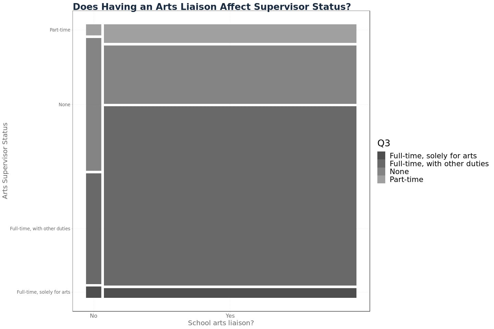

Eric Boxer
26 March, 2019

NYC Schools Arts Survey Data
----------------------------

The [2017-2018 Arts Survey Data](https://data.cityofnewyork.us/Education/2017-2018-Arts-Survey-Data/475h-cg5t) has data about arts teachers, budgets, partnerships with cultural organizations and parental involvement in NYC public schools.

In an effort to gain greater context for this data, we can examine it in conjuction with publicly available [ELA and Math state test results](https://infohub.nyced.org/reports-and-policies/citywide-information-and-data/test-results) and [demographic data](https://data.cityofnewyork.us/Education/2013-2018-Demographic-Snapshot-School/s52a-8aq6).

My goals were to understand the state of arts programs in NYC schools, what variables affect the resources of arts programs, and whether arts programs have an effect on the academic performance of students.

### Arts Education Liaison

In 2018, 1265 schools were surveyed. Schools were asked whether they have a designated arts supervisor. 5.6%, 72 schools, had no arts supervisor. My first question has to do with whether there is any relation between the presence of an arts supervisor and the demographics of the student population.


Schools without a designated arts supervisor appear to have more black students than those with supervisors (Fig 4). There appear to be several schools withan arts supervisor and very high poverty, but there is no clear relation (Fig 2). I also do not see a significant relation between total enrollment (Fig 1) or student gender ratio (Fig 3) and having an arts supervisor. Most schools have about 500 students and gender splits close to 50-50 so a small difference would be hard to detect in these graphs.

In order to assess the significance of the differences pointed we see above, we can try to fit a logistic regression to the relationship between each variable and the binary response "Does the school have an an arts supervisor?"

These regressions lend support to the differences spotted in the plots of student poverty and race, but the most statistically significant coefficient comes from total enrollment. The coefficient for total enrollment is negative with a p-value below a significance level of 0.001. Percentages of impoverished and black students have positive coefficients with p-values below a significance level of 0.01. As we had assumed from the graphs, there was no significant relation between gender and whether a school had an arts supervisor.
In order to better interpret these results I converted the standard R logistic regression coefficients into relative risk, [as seen here](https://www.bmj.com/content/348/bmj.f7450.full?ijkey=NHT1YVsoX1RCm8r&keytype=ref).

    ## $total_enrollment_2017
    ## [1] 0.9975802
    ## 
    ## $perc_pov_2017
    ## [1] 1.021338
    ## 
    ## $perc_black_2017
    ## [1] 1.012599

An increase in total enrollment of one student is associated with a .25% decrease in the likelihood that a school has an arts supervisor. An increase of one percentage point in student poverty and in share of black students is associated with 2.13% and 1.26% increases, respectively, in the likelihood that a school has an arts supervisor.

Consider the possibility that there is confounding between these variables, ie. small schools tend to serve poor, mostly black student populations. To address this possibility I ran a logistic regression upon total enrollment, student poverty and share of black students. This yielded only one significant feature, total enrollment, supporting some sort of statistical interdependence between the variables.
Let S denote school art supervisor, E enrollment, P poverty and B black students.


To further investigate confounding, I ran a linear model for total enrollment on percentage of impoverished and black students. As suspected, both had negative relationships with total enrollment. In particular, with a p-value less than significance level 0.001, each additional percentage point of black students was associated with a decrease of 5.22 students.

As a former NYC public school student this coincides with my experience of the school system. In my old neighborhood of Canarsie in Brooklyn was a school previously known as South Shore High School. It served thousands of poor, majority minority students. In 2010, the school was converted into the [South Shore Educational Complex](https://insideschools.org/school/18K515) and now houses five smaller high schools. A naive observer could be expected to assume that small schools have higher faculty:student ratios and more resources to expend on their students. In reality the policies of the NYC DOE have led to the exact opposite, with underperforming schools split up without necessarily being given the resources to turn around their performance.

My second question is whether there is any relation between having an arts supervisor and student academic performance.

    ## 
    ## Call:
    ## lm(formula = perc_34_all_2018_ela ~ ., data = .)
    ## 
    ## Residuals:
    ##     Min      1Q  Median      3Q     Max 
    ## -46.914 -16.395  -3.014  15.136  62.224 
    ## 
    ## Coefficients:
    ##             Estimate Std. Error t value Pr(>|t|)    
    ## (Intercept)  46.9138     0.6966  67.346  < 2e-16 ***
    ## Q2_1        -11.0378     2.9472  -3.745 0.000192 ***
    ## ---
    ## Signif. codes:  0 '***' 0.001 '**' 0.01 '*' 0.05 '.' 0.1 ' ' 1
    ## 
    ## Residual standard error: 20.25 on 893 degrees of freedom
    ##   (370 observations deleted due to missingness)
    ## Multiple R-squared:  0.01546,    Adjusted R-squared:  0.01436 
    ## F-statistic: 14.03 on 1 and 893 DF,  p-value: 0.0001918

    ## 
    ## Call:
    ## lm(formula = perc_34_all_2018_ela ~ ., data = .)
    ## 
    ## Residuals:
    ##     Min      1Q  Median      3Q     Max 
    ## -33.682  -9.306  -1.539   7.298  53.259 
    ## 
    ## Coefficients:
    ##                        Estimate Std. Error t value Pr(>|t|)    
    ## (Intercept)           94.734711   1.802482  52.558  < 2e-16 ***
    ## Q2_1                  -2.866684   1.844428  -1.554 0.120483    
    ## perc_pov_2017         -0.638242   0.020032 -31.860  < 2e-16 ***
    ## perc_black_2017       -0.119648   0.017993  -6.650 5.12e-11 ***
    ## total_enrollment_2017  0.004533   0.001353   3.350 0.000843 ***
    ## ---
    ## Signif. codes:  0 '***' 0.001 '**' 0.01 '*' 0.05 '.' 0.1 ' ' 1
    ## 
    ## Residual standard error: 12.49 on 890 degrees of freedom
    ##   (370 observations deleted due to missingness)
    ## Multiple R-squared:  0.6267, Adjusted R-squared:  0.625 
    ## F-statistic: 373.5 on 4 and 890 DF,  p-value: < 2.2e-16

    ## 
    ## Call:
    ## lm(formula = perc_34_all_2018_math ~ ., data = .)
    ## 
    ## Residuals:
    ##     Min      1Q  Median      3Q     Max 
    ## -43.595 -18.795  -4.495  16.955  68.652 
    ## 
    ## Coefficients:
    ##             Estimate Std. Error t value Pr(>|t|)    
    ## (Intercept)  43.5953     0.7969  54.705  < 2e-16 ***
    ## Q2_1        -14.0473     3.3716  -4.166  3.4e-05 ***
    ## ---
    ## Signif. codes:  0 '***' 0.001 '**' 0.01 '*' 0.05 '.' 0.1 ' ' 1
    ## 
    ## Residual standard error: 23.17 on 893 degrees of freedom
    ##   (370 observations deleted due to missingness)
    ## Multiple R-squared:  0.01907,    Adjusted R-squared:  0.01797 
    ## F-statistic: 17.36 on 1 and 893 DF,  p-value: 3.397e-05

    ## 
    ## Call:
    ## lm(formula = perc_34_all_2018_math ~ ., data = .)
    ## 
    ## Residuals:
    ##     Min      1Q  Median      3Q     Max 
    ## -40.137 -10.644  -2.267   8.213  63.174 
    ## 
    ## Coefficients:
    ##                        Estimate Std. Error t value Pr(>|t|)    
    ## (Intercept)           92.029270   2.178865  42.237  < 2e-16 ***
    ## Q2_1                  -4.442436   2.229570  -1.993   0.0466 *  
    ## perc_pov_2017         -0.629027   0.024215 -25.976  < 2e-16 ***
    ## perc_black_2017       -0.219982   0.021750 -10.114  < 2e-16 ***
    ## total_enrollment_2017  0.006570   0.001636   4.016 6.42e-05 ***
    ## ---
    ## Signif. codes:  0 '***' 0.001 '**' 0.01 '*' 0.05 '.' 0.1 ' ' 1
    ## 
    ## Residual standard error: 15.1 on 890 degrees of freedom
    ##   (370 observations deleted due to missingness)
    ## Multiple R-squared:  0.5847, Adjusted R-squared:  0.5828 
    ## F-statistic: 313.2 on 4 and 890 DF,  p-value: < 2.2e-16

To measure academic performance, we can use the percentage of students to receive a 3 or 4 on state standardized tests (grades corresponding to at or above expectations), denoted `perc_34`. If we consider the relationship between having an arts supervisor and academic performance, then we see an 11 and 14 point decrease in English Language Arts (ELA) and math, respectively, at a significance level less than 0.001.
However, considering the causal relationship above, we can introduce context by conditioning on student poverty, share of black students, and total enrollment. In this case we do not have any statistically significant relation with ELA scores and a four point decrease in math scores, but at a 0.04 significance level.

Next time, I will continue going through the survey. The presence of an arts supervisor does not necessarily equate to a well-resourced and efficacious arts program, so I hope to find some interesting questions.

Part Two
--------

### Arts Supervisors

New York City public schools were asked whether their arts supervisor was employed full- or part-time. If their supervisor was full-time, schools clarified whether they were solely working on arts programs or had other responsibilities.
In small schools, or under-resourced ones, faculty may be expected to wear many hats. In the simplest cases, physical education teachers lead gym and health classes. More extreme examples can have teachers with certification in, for example, English teaching classes in math or science. I do not assert that an arts supervisor *must* be employed full-time to run an effective program, but I am curious as to what features predict their employment status.


There are many full-time supervisors with duties other than the arts. I would be curious to discover the share of their responsibilities that are considered "other". It is possible that some administrators consider teaching an arts class or doing clerical work to be "other". Relative to the number of supervisors working full-time, there are few part-timers.

Only two schools did not respond to this question about their arts supervisor's status. In the previous [part](https://ecboxer.github.io/eda/art_education/arts_survey_1.html), I looked at the question of whether a school had a designated arts liaison. 72 schools responded that they did not, while 296 schools do not have any arts supervisor. I wonder whether the presence of an arts supervisor has more or less influence on student academic performance, relative to arts liaisons.

To begin exploring academic performance, I will use the percentage of students to perform at or above standards for English Language Arts (ELA) and math.


I came into this analysis with some suspicion that arts programs might be more beneficial for ELA performance than for math, if they were to have any effect. In the plot above there is a positive relationship between ELA and math scores, regardless of art supervisor status.

    ## 
    ## Call:
    ## lm(formula = Math_score ~ ., data = .)
    ## 
    ## Residuals:
    ##     Min      1Q  Median      3Q     Max 
    ## -32.578  -4.957   0.679   5.235  32.163 
    ## 
    ## Coefficients:
    ##             Estimate Std. Error t value Pr(>|t|)    
    ## (Intercept) -6.45658    0.72046  -8.962   <2e-16 ***
    ## ELA_score    1.06415    0.01424  74.718   <2e-16 ***
    ## ---
    ## Signif. codes:  0 '***' 0.001 '**' 0.01 '*' 0.05 '.' 0.1 ' ' 1
    ## 
    ## Residual standard error: 8.686 on 893 degrees of freedom
    ##   (370 observations deleted due to missingness)
    ## Multiple R-squared:  0.8621, Adjusted R-squared:  0.8619 
    ## F-statistic:  5583 on 1 and 893 DF,  p-value: < 2.2e-16

#### Output 1

On inspection the relation between the two scores seems identical between supervisor statuses. In fact, fitting a linear regression to each yields coefficients close to the uncontrolled coefficient for math scores on ELA scores, 1.06415 (Output 1). *M**a**t**h*\_*s**c**o**r**e* = *β*<sub>0</sub> + *β*<sub>1</sub> \* *E**L**A*\_*s**c**o**r**e*

    ## 
    ## Call:
    ## lm(formula = Math_score ~ ., data = .)
    ## 
    ## Residuals:
    ##     Min      1Q  Median      3Q     Max 
    ## -32.854  -4.955   0.520   5.357  31.868 
    ## 
    ## Coefficients:
    ##              Estimate Std. Error t value Pr(>|t|)    
    ## (Intercept) -20.80595    8.66873  -2.400   0.0166 *  
    ## Q3_1         10.11455    8.84006   1.144   0.2529    
    ## Q3_2         14.62550    8.66724   1.687   0.0919 .  
    ## Q3_3         13.37116    8.73705   1.530   0.1263    
    ## Q3_4         14.28427    8.68146   1.645   0.1002    
    ## ELA_score     1.06450    0.01421  74.922   <2e-16 ***
    ## ---
    ## Signif. codes:  0 '***' 0.001 '**' 0.01 '*' 0.05 '.' 0.1 ' ' 1
    ## 
    ## Residual standard error: 8.657 on 889 degrees of freedom
    ##   (370 observations deleted due to missingness)
    ## Multiple R-squared:  0.8636, Adjusted R-squared:  0.8628 
    ## F-statistic:  1126 on 5 and 889 DF,  p-value: < 2.2e-16

#### Output 2

We can control for supervisor status with dummy variables by altering the regression like so, *M**a**t**h*\_*s**c**o**r**e* = *β*<sub>0</sub> + *β*<sub>1</sub> \* *E**L**A*\_*s**c**o**r**e* + *β*<sub>2</sub> \* *Q*3\_1 + *β*<sub>3</sub> \* *Q*3\_2 + *β*<sub>4</sub> \* *Q*3\_3 + *β*<sub>5</sub> \* *Q*3\_4, where *Q*3\_*i* corresponds to the *i*<sup>*t**h*</sup> member of the list `c('Full-time, solely for arts', 'Full-time, with other duties', 'Part-time', 'None')` (Output 2).

    ##                  2.5 %    97.5 %
    ## (Intercept) -37.819514 -3.792379
    ## Q3_1         -7.235276 27.464384
    ## Q3_2         -2.385138 31.636142
    ## Q3_3         -3.776499 30.518809
    ## Q3_4         -2.754271 31.322808
    ## ELA_score     1.036615  1.092385

#### Output 3

This model specification does not result in a compellingly significant coefficient for the effect of a particular supervisor status. Any status is estimated to have a positive coefficient, but a 95% confidence interval (Output 3) does not exclude the possibility that any of status coefficients could be zero.

``` r
delta.beta1 <- coefficients(lm.fit.null.summ)[2,1] - coefficients(lm.fit.summ)[6,1]
delta.beta1
```

    ## [1] -0.0003517423

``` r
se.delta.beta1 <- sqrt(coefficients(lm.fit.null.summ)[2,2]^2 + coefficients(lm.fit.summ)[6,2]^2)
se.delta.beta1
```

    ## [1] 0.02011739

#### Output 4

On inspection, the regression coefficients for `ELA_score` are close between model specifications A (no controls) and B (controlling for supervisor status). The difference in estimated coefficients *β*<sub>1</sub> is -0.0003 (Output 4). To find the variability of the difference in regression coefficients, we use the formula *V**a**r*(*A* − *B*)=*V**a**r*(*A*)+*V**a**r*(*B*)−2 \* *C**o**v*(*A*, *B*). Assuming covariance between the two estimates is zero, we arrive at 0.0201 as the standard error of the difference.
Now I can assert that there is no difference in the relationsip between ELA and math scores from supervisor statuses.



This mosaic plot illustrates that the proportion of schools without an arts program supervisor is greater for schools without an arts liaison that for those with. This lends support to the idea that those schools are lacking the resources to fully staff their arts programs, as they have not filled two key positions. It is of course possible that arts liaisons and supervisors are not necessary to effective programs, and schools without either are running just fine. I would like to assess the quality of the arts programs themselves as a function their liaison and supervisor statuses, perhaps through some sort of measure of funding or arts resources.

------------------------------------------------------------------------

The next questions concern certifications that arts supervisors may have, either in an arts discipline or in administration.


Few supervisors are certified in the arts, the majority are administrators. Could this have an impact on the efficacy of an arts program?

Linear regressions do not yield a statistically significant result for the effect of either or both supervisor certification on student academic performance. The model specifications I tried out were of the form *s**c**o**r**e* = *β*<sub>0</sub> + *β*<sub>1</sub> \* *a**r**t**s*\_*c**e**r**t* + *β*<sub>2</sub> \* *a**d**m**i**n*\_*c**e**r**t* + *β*<sub>3</sub> \* *b**o**t**h*\_*c**e**r**t*.

    ## 
    ## Call:
    ## lm(formula = perc_34_all_2018_ela ~ ., data = .)
    ## 
    ## Residuals:
    ##     Min      1Q  Median      3Q     Max 
    ## -32.521  -9.023  -1.700   7.244  54.364 
    ## 
    ## Coefficients:
    ##                        Estimate Std. Error t value Pr(>|t|)    
    ## (Intercept)           93.980634   1.850377  50.790  < 2e-16 ***
    ## arts_cert              1.164997   1.758245   0.663 0.507765    
    ## admin_cert             1.167456   0.942800   1.238 0.215937    
    ## both_cert              1.002057   2.934071   0.342 0.732789    
    ## total_enrollment_2017  0.004566   0.001363   3.351 0.000839 ***
    ## perc_black_2017       -0.119051   0.018022  -6.606  6.8e-11 ***
    ## perc_pov_2017         -0.642529   0.020084 -31.993  < 2e-16 ***
    ## ---
    ## Signif. codes:  0 '***' 0.001 '**' 0.01 '*' 0.05 '.' 0.1 ' ' 1
    ## 
    ## Residual standard error: 12.5 on 888 degrees of freedom
    ##   (370 observations deleted due to missingness)
    ## Multiple R-squared:  0.6268, Adjusted R-squared:  0.6243 
    ## F-statistic: 248.6 on 6 and 888 DF,  p-value: < 2.2e-16

    ##                              2.5 %       97.5 %
    ## (Intercept)           90.349011532 97.612257433
    ## arts_cert             -2.285803835  4.615797128
    ## admin_cert            -0.682920159  3.017833144
    ## both_cert             -4.756465157  6.760580155
    ## total_enrollment_2017  0.001891955  0.007240283
    ## perc_black_2017       -0.154420668 -0.083680879
    ## perc_pov_2017         -0.681945909 -0.603112479

    ## 
    ## Call:
    ## lm(formula = perc_34_all_2018_math ~ ., data = .)
    ## 
    ## Residuals:
    ##     Min      1Q  Median      3Q     Max 
    ## -41.852 -10.756  -2.115   8.057  63.109 
    ## 
    ## Coefficients:
    ##                        Estimate Std. Error t value Pr(>|t|)    
    ## (Intercept)           91.616504   2.239070  40.917  < 2e-16 ***
    ## arts_cert             -1.728792   2.127584  -0.813    0.417    
    ## admin_cert             0.942806   1.140846   0.826    0.409    
    ## both_cert              3.165637   3.550406   0.892    0.373    
    ## total_enrollment_2017  0.006623   0.001649   4.017  6.4e-05 ***
    ## perc_black_2017       -0.219876   0.021807 -10.083  < 2e-16 ***
    ## perc_pov_2017         -0.634167   0.024302 -26.095  < 2e-16 ***
    ## ---
    ## Signif. codes:  0 '***' 0.001 '**' 0.01 '*' 0.05 '.' 0.1 ' ' 1
    ## 
    ## Residual standard error: 15.13 on 888 degrees of freedom
    ##   (370 observations deleted due to missingness)
    ## Multiple R-squared:  0.584,  Adjusted R-squared:  0.5812 
    ## F-statistic: 207.8 on 6 and 888 DF,  p-value: < 2.2e-16

    ##                              2.5 %       97.5 %
    ## (Intercept)           87.222017963 96.010989772
    ## arts_cert             -5.904471567  2.446887747
    ## admin_cert            -1.296263104  3.181874756
    ## both_cert             -3.802527434 10.133801854
    ## total_enrollment_2017  0.003386955  0.009858758
    ## perc_black_2017       -0.262675858 -0.177076386
    ## perc_pov_2017         -0.681863289 -0.586470017

#### Output 5

After controlling for school size and percentage of black and impoverished students, there is no statistically significant effect for certifications on academic performance. A 95% confidence interval of the coefficient for supervisor certification in administration includes zero for ELA and math scores, so we cannot claim that there is a statistically significant nonzero effect on academic performance. The confidence interval for arts or both certifications are even wider.

    ## 
    ## Call:
    ## lm(formula = perc_4_all_2018_ela ~ ., data = .)
    ## 
    ## Residuals:
    ##     Min      1Q  Median      3Q     Max 
    ## -29.574  -5.502  -1.417   3.625  57.556 
    ## 
    ## Coefficients:
    ##                        Estimate Std. Error t value Pr(>|t|)    
    ## (Intercept)           48.868172   1.405134  34.778  < 2e-16 ***
    ## arts_cert              0.862021   1.335171   0.646    0.519    
    ## admin_cert             0.543582   0.715941   0.759    0.448    
    ## both_cert              3.240655   2.228066   1.454    0.146    
    ## total_enrollment_2017  0.005410   0.001035   5.229 2.13e-07 ***
    ## perc_black_2017       -0.054557   0.013685  -3.987 7.25e-05 ***
    ## perc_pov_2017         -0.453225   0.015251 -29.718  < 2e-16 ***
    ## ---
    ## Signif. codes:  0 '***' 0.001 '**' 0.01 '*' 0.05 '.' 0.1 ' ' 1
    ## 
    ## Residual standard error: 9.494 on 888 degrees of freedom
    ##   (370 observations deleted due to missingness)
    ## Multiple R-squared:  0.5861, Adjusted R-squared:  0.5833 
    ## F-statistic: 209.5 on 6 and 888 DF,  p-value: < 2.2e-16

    ##                              2.5 %       97.5 %
    ## (Intercept)           46.110400736 51.625943358
    ## arts_cert             -1.758437940  3.482479797
    ## admin_cert            -0.861551453  1.948715865
    ## both_cert             -1.132235198  7.613545292
    ## total_enrollment_2017  0.003379317  0.007440715
    ## perc_black_2017       -0.081416450 -0.027698274
    ## perc_pov_2017         -0.483157590 -0.423293288

    ## 
    ## Call:
    ## lm(formula = perc_4_all_2018_math ~ ., data = .)
    ## 
    ## Residuals:
    ##     Min      1Q  Median      3Q     Max 
    ## -35.383  -7.853  -2.417   5.387  58.260 
    ## 
    ## Coefficients:
    ##                        Estimate Std. Error t value Pr(>|t|)    
    ## (Intercept)           59.773655   1.820197  32.839  < 2e-16 ***
    ## arts_cert             -1.894760   1.729567  -1.096 0.273590    
    ## admin_cert             0.277532   0.927423   0.299 0.764818    
    ## both_cert              5.689689   2.886215   1.971 0.048996 *  
    ## total_enrollment_2017  0.005234   0.001340   3.905 0.000101 ***
    ## perc_black_2017       -0.154016   0.017728  -8.688  < 2e-16 ***
    ## perc_pov_2017         -0.508582   0.019756 -25.743  < 2e-16 ***
    ## ---
    ## Signif. codes:  0 '***' 0.001 '**' 0.01 '*' 0.05 '.' 0.1 ' ' 1
    ## 
    ## Residual standard error: 12.3 on 888 degrees of freedom
    ##   (370 observations deleted due to missingness)
    ## Multiple R-squared:  0.5648, Adjusted R-squared:  0.5619 
    ## F-statistic: 192.1 on 6 and 888 DF,  p-value: < 2.2e-16

    ##                              2.5 %       97.5 %
    ## (Intercept)           56.201265512 63.346043902
    ## arts_cert             -5.289275597  1.499756483
    ## admin_cert            -1.542663701  2.097728293
    ## both_cert              0.025091309 11.354287317
    ## total_enrollment_2017  0.002603756  0.007864849
    ## perc_black_2017       -0.188808711 -0.119222727
    ## perc_pov_2017         -0.547356080 -0.469808466

#### Output 6

If we drill down further, looking at only the percentage of students to receive a 4 (the highest grade), then there is a statistically significant coefficient for the effect of both certifications on math scores, with a p-value of 0.048996 (Output 6). In this case, a 95% confidence interval just excludes zero, being \[0.025, 11.354\].
Having been able to arrive at this more tenuous result I feel a renewed belief that arts programs do have an effect on academic performance and that some proof is lying in the data somewhere. On the other hand I am suspicious as to how I *manufactured* this result by narrowing my focus until I hacked my way to an accceptable p-value.

Data Provenance
---------------

The [2017-2018 Arts Survey Data](https://data.cityofnewyork.us/Education/2017-2018-Arts-Survey-Data/475h-cg5t) has data about arts teachers, budgets, partnerships with cultural organizations and parental involvement in NYC public schools.

In an effort to gain greater context for this data, I have examined it in conjuction with publicly available [ELA and Math state test results](https://infohub.nyced.org/reports-and-policies/citywide-information-and-data/test-results) and [demographic data](https://data.cityofnewyork.us/Education/2013-2018-Demographic-Snapshot-School/s52a-8aq6).

My goals are to understand the state of arts programs in NYC schools, what variables affect the resources of arts programs, and whether arts programs have an effect on the academic performance of students.

Part Three
----------

### Resources Devoted to Arts Education

This is part of an extended look at the NYC School Arts Survey:
[Part One: Arts Education Liaisons](https://ecboxer.github.io/eda/art_education/arts_survey_1.html)
[Part Two: Arts Education Supervisors](https://ecboxer.github.io/eda/art_education/arts_survey_2.html)

The survey had several questions regarding which resources schools are devoting to arts education, whether the administrator thought they were sufficient and which non-Department of Education sources of support were available to them.

Schools were asked how many rooms they have dedicated to arts education. Rooms were divided into two categories: "rooms designed and used solely for the arts" and "multi-purpose or general education classroooms used for arts education". Five arts disciplines were considered: dance, music, theater, visual arts, and media arts (a category which includes film and photography). Note that the term media arts refers to film programs.
Number of rooms is certainly not a direct metric for a school's commitment to the arts. I hypothesize that it may prove useful for assessing the resources that are made available for arts education more broadly. Of course, there may be confounding factors, such as school size and borough.


All disciplines show the same trend; many schools have zero to two rooms for a given discipline and a few schools have more than twenty rooms. Having twenty-some rooms might be bordering on unrealistic, but the above plots depict both categories of rooms, those designed solely for the arts and multi-purpose. Will we get more reasonable numbers by examining the room counts separately?


Looking at the number of rooms designed solely for the arts, the maximum number of rooms is a more reasonable thirteen. For a school with several hundred students and a dedicated arts program I can picture that. If we look at multi-purpose rooms, we see that this class contains the bulk of the rooms. Not many schools have dozens of multi-purpose rooms for arts disciplines, but again, in the context of a large school, it seems like a possible number for some schools to have.
I would be curious to discover the overlap for multi-purpose rooms among arts disciplines. In other words, is a school with twenty multi-purpose rooms reporting some of those rooms as in use for multiple arts discipline? I do not see any way to completely correct for that possibility, but it would be interesting to control for school size to try to get to the bottom of it. If this does not work, then we could consider only the number of rooms designed solely for art, but this could penalize small schools unduly.

    ## 
    ## Call:
    ## lm(formula = perc_34_all_2018_ela ~ ., data = .)
    ## 
    ## Residuals:
    ##     Min      1Q  Median      3Q     Max 
    ## -38.706 -15.286  -3.482  13.757  57.410 
    ## 
    ## Coefficients:
    ##                        Estimate Std. Error t value Pr(>|t|)    
    ## (Intercept)           37.172301   1.540811  24.125  < 2e-16 ***
    ## dance_rooms            0.198147   0.203517   0.974    0.331    
    ## music_rooms           -0.019724   0.170177  -0.116    0.908    
    ## theater_rooms         -0.046773   0.195201  -0.240    0.811    
    ## visual_arts_rooms      0.186354   0.137639   1.354    0.176    
    ## media_arts_rooms      -0.141977   0.162441  -0.874    0.382    
    ## total_enrollment_2017  0.014001   0.002242   6.245 7.33e-10 ***
    ## ---
    ## Signif. codes:  0 '***' 0.001 '**' 0.01 '*' 0.05 '.' 0.1 ' ' 1
    ## 
    ## Residual standard error: 19.62 on 706 degrees of freedom
    ##   (552 observations deleted due to missingness)
    ## Multiple R-squared:  0.06461,    Adjusted R-squared:  0.05666 
    ## F-statistic: 8.127 on 6 and 706 DF,  p-value: 1.642e-08

    ## 
    ## Call:
    ## lm(formula = perc_34_all_2018_math ~ ., data = .)
    ## 
    ## Residuals:
    ##     Min      1Q  Median      3Q     Max 
    ## -44.704 -17.891  -4.972  15.429  60.377 
    ## 
    ## Coefficients:
    ##                        Estimate Std. Error t value Pr(>|t|)    
    ## (Intercept)           30.379442   1.751426  17.346  < 2e-16 ***
    ## dance_rooms            0.187916   0.231335   0.812   0.4169    
    ## music_rooms            0.142808   0.193439   0.738   0.4606    
    ## theater_rooms          0.048594   0.221883   0.219   0.8267    
    ## visual_arts_rooms      0.258630   0.156453   1.653   0.0988 .  
    ## media_arts_rooms      -0.206618   0.184645  -1.119   0.2635    
    ## total_enrollment_2017  0.018216   0.002549   7.147 2.21e-12 ***
    ## ---
    ## Signif. codes:  0 '***' 0.001 '**' 0.01 '*' 0.05 '.' 0.1 ' ' 1
    ## 
    ## Residual standard error: 22.3 on 706 degrees of freedom
    ##   (552 observations deleted due to missingness)
    ## Multiple R-squared:  0.09644,    Adjusted R-squared:  0.08876 
    ## F-statistic: 12.56 on 6 and 706 DF,  p-value: 1.747e-13

#### Output 7

Conditioning on the effect of school size, through total enrollment, we can see no statistically significant effect for the total number of rooms for arts education on student academic performance (Ouptput 7).

    ## 
    ## Call:
    ## lm(formula = perc_34_all_2018_ela ~ ., data = .)
    ## 
    ## Residuals:
    ##     Min      1Q  Median      3Q     Max 
    ## -39.233 -15.704  -3.011  13.495  54.952 
    ## 
    ## Coefficients:
    ##                       Estimate Std. Error t value Pr(>|t|)    
    ## (Intercept)           36.98124    1.56537  23.625  < 2e-16 ***
    ## Q8_R1_C1              -1.92913    1.36332  -1.415 0.157452    
    ## Q8_R2_C1               3.30383    0.91647   3.605 0.000332 ***
    ## Q8_R3_C1               0.92597    1.04167   0.889 0.374312    
    ## Q8_R4_C1               0.16888    1.18807   0.142 0.886998    
    ## Q8_R5_C1              -1.84882    1.00594  -1.838 0.066449 .  
    ## total_enrollment_2017  0.01312    0.00221   5.938  4.3e-09 ***
    ## ---
    ## Signif. codes:  0 '***' 0.001 '**' 0.01 '*' 0.05 '.' 0.1 ' ' 1
    ## 
    ## Residual standard error: 19.51 on 797 degrees of freedom
    ##   (461 observations deleted due to missingness)
    ## Multiple R-squared:  0.08419,    Adjusted R-squared:  0.0773 
    ## F-statistic: 12.21 on 6 and 797 DF,  p-value: 3.603e-13

    ## 
    ## Call:
    ## lm(formula = perc_34_all_2018_math ~ ., data = .)
    ## 
    ## Residuals:
    ##     Min      1Q  Median      3Q     Max 
    ## -39.170 -17.415  -4.067  14.767  58.385 
    ## 
    ## Coefficients:
    ##                        Estimate Std. Error t value Pr(>|t|)    
    ## (Intercept)           31.887968   1.772957  17.986  < 2e-16 ***
    ## Q8_R1_C1              -3.390478   1.544105  -2.196   0.0284 *  
    ## Q8_R2_C1               2.964480   1.037997   2.856   0.0044 ** 
    ## Q8_R3_C1               0.795531   1.179807   0.674   0.5003    
    ## Q8_R4_C1              -0.890543   1.345613  -0.662   0.5083    
    ## Q8_R5_C1              -2.400571   1.139337  -2.107   0.0354 *  
    ## total_enrollment_2017  0.019294   0.002503   7.707 3.82e-14 ***
    ## ---
    ## Signif. codes:  0 '***' 0.001 '**' 0.01 '*' 0.05 '.' 0.1 ' ' 1
    ## 
    ## Residual standard error: 22.1 on 797 degrees of freedom
    ##   (461 observations deleted due to missingness)
    ## Multiple R-squared:  0.104,  Adjusted R-squared:  0.09722 
    ## F-statistic: 15.41 on 6 and 797 DF,  p-value: < 2.2e-16

#### Output 8

Controlling for school size, through total student enrollment, we can see a statistically significant (p-value less than 0.001) positive coefficient for the effect of additional rooms designed and used solely for music, on ELA state test scores (Output 8). If we consider math scores, rooms solely dedicated to music still have a positive effect, but at a 0.0044 p-value. No other arts disciplines have a statistically significant effect on ELA scores, but dance and media arts rooms have statistically significant (p-value less than 0.05) negative effects on math scores.
When we consider multi-purpose rooms, no arts discipline has a statistically significant effect on academic performance.
I am curious about the reason behind why music rooms appear to be associated with higher test scores, and why dance and media arts are associated with lower scores. To investigate we can try to control for different features and divide the performance metric by grade.

    ## [1] "perc_34_5_2018_ela"
    ## 
    ## Call:
    ## lm(formula = f.ela, data = .)
    ## 
    ## Residuals:
    ##     Min      1Q  Median      3Q     Max 
    ## -37.072 -16.524  -3.894  15.154  65.915 
    ## 
    ## Coefficients:
    ##                        Estimate Std. Error t value Pr(>|t|)    
    ## (Intercept)           30.393260   2.172697  13.989  < 2e-16 ***
    ## total_enrollment_2017  0.010224   0.002857   3.579 0.000375 ***
    ## Q8_R1_C1              -1.070094   1.677094  -0.638 0.523694    
    ## Q8_R2_C1               3.047105   1.061100   2.872 0.004239 ** 
    ## Q8_R3_C1              -0.076777   1.189206  -0.065 0.948546    
    ## Q8_R4_C1              -0.120480   1.501049  -0.080 0.936057    
    ## Q8_R5_C1              -0.440556   1.291528  -0.341 0.733148    
    ## ---
    ## Signif. codes:  0 '***' 0.001 '**' 0.01 '*' 0.05 '.' 0.1 ' ' 1
    ## 
    ## Residual standard error: 20.13 on 556 degrees of freedom
    ## Multiple R-squared:  0.04519,    Adjusted R-squared:  0.03489 
    ## F-statistic: 4.386 on 6 and 556 DF,  p-value: 0.000242
    ## 
    ## [1] "perc_34_6_2018_ela"
    ## 
    ## Call:
    ## lm(formula = f.ela, data = .)
    ## 
    ## Residuals:
    ##     Min      1Q  Median      3Q     Max 
    ## -41.030 -16.090  -3.834  12.920  55.424 
    ## 
    ## Coefficients:
    ##                        Estimate Std. Error t value Pr(>|t|)    
    ## (Intercept)           32.107149   2.400189  13.377  < 2e-16 ***
    ## total_enrollment_2017  0.019201   0.003511   5.469 9.17e-08 ***
    ## Q8_R1_C1              -0.386109   2.053572  -0.188  0.85098    
    ## Q8_R2_C1               2.890346   1.386475   2.085  0.03789 *  
    ## Q8_R3_C1               3.378799   2.188257   1.544  0.12357    
    ## Q8_R4_C1               1.694171   1.881632   0.900  0.36860    
    ## Q8_R5_C1              -4.765419   1.542141  -3.090  0.00218 ** 
    ## ---
    ## Signif. codes:  0 '***' 0.001 '**' 0.01 '*' 0.05 '.' 0.1 ' ' 1
    ## 
    ## Residual standard error: 20.26 on 319 degrees of freedom
    ## Multiple R-squared:  0.1908, Adjusted R-squared:  0.1756 
    ## F-statistic: 12.53 on 6 and 319 DF,  p-value: 1.08e-12

    ## [1] "perc_34_5_2018_math"
    ## 
    ## Call:
    ## lm(formula = f.math, data = .)
    ## 
    ## Residuals:
    ##     Min      1Q  Median      3Q     Max 
    ## -42.241 -19.010  -3.535  16.810  65.205 
    ## 
    ## Coefficients:
    ##                        Estimate Std. Error t value Pr(>|t|)    
    ## (Intercept)           30.370138   2.450852  12.392  < 2e-16 ***
    ## total_enrollment_2017  0.015948   0.003225   4.944 1.01e-06 ***
    ## Q8_R1_C1              -1.021941   1.892332  -0.540 0.589384    
    ## Q8_R2_C1               3.959590   1.195636   3.312 0.000988 ***
    ## Q8_R3_C1              -0.436070   1.340461  -0.325 0.745066    
    ## Q8_R4_C1              -1.058457   1.691447  -0.626 0.531723    
    ## Q8_R5_C1              -0.904146   1.456523  -0.621 0.535015    
    ## ---
    ## Signif. codes:  0 '***' 0.001 '**' 0.01 '*' 0.05 '.' 0.1 ' ' 1
    ## 
    ## Residual standard error: 22.68 on 555 degrees of freedom
    ## Multiple R-squared:  0.07056,    Adjusted R-squared:  0.06051 
    ## F-statistic: 7.023 on 6 and 555 DF,  p-value: 3.232e-07
    ## 
    ## [1] "perc_34_6_2018_math"
    ## 
    ## Call:
    ## lm(formula = f.math, data = .)
    ## 
    ## Residuals:
    ##     Min      1Q  Median      3Q     Max 
    ## -48.190 -16.714  -4.699  10.401  67.053 
    ## 
    ## Coefficients:
    ##                        Estimate Std. Error t value Pr(>|t|)    
    ## (Intercept)           18.231937   2.592891   7.032 1.25e-11 ***
    ## total_enrollment_2017  0.021830   0.003808   5.733 2.29e-08 ***
    ## Q8_R1_C1              -0.022742   2.227755  -0.010  0.99186    
    ## Q8_R2_C1               3.955813   1.502217   2.633  0.00887 ** 
    ## Q8_R3_C1               2.114419   2.368073   0.893  0.37259    
    ## Q8_R4_C1               2.738886   2.038702   1.343  0.18008    
    ## Q8_R5_C1              -4.635148   1.673390  -2.770  0.00594 ** 
    ## ---
    ## Signif. codes:  0 '***' 0.001 '**' 0.01 '*' 0.05 '.' 0.1 ' ' 1
    ## 
    ## Residual standard error: 21.97 on 319 degrees of freedom
    ## Multiple R-squared:  0.218,  Adjusted R-squared:  0.2033 
    ## F-statistic: 14.82 on 6 and 319 DF,  p-value: 5.957e-15

#### Output 9

If we break down academic performance by grade, then the results are not as straigtforward (Output 9). For sixth-, seventh- and eighth-graders' ELA performance, media arts rooms have a more statistically significant negative coefficient than the positive coefficient for music rooms. All grades show a positive coefficient for music rooms, with a p-value no more than 0.01. There is a large jump in media arts between fifth- and sixth-grades, which is the demarcation between elementary and middle schools. A jump of this nature could have an underlying reason, beyond increased susceptibility to media arts programs at the expense of academic performance beginning in middle school. Perhaps not many elementary schools have media arts programs at all, or they are more commonly found in schools that are otherwise performing at an atypical level (higher or lower). Both of these can be checked.
Math scores show a similar trend to ELA scores, with most grades showing a statistically significant positive coefficient for music rooms. Among middle schools, media arts rooms have a statistically significant negative coefficient. The key difference with ELA scores is that there is not a statistically significant positive coefficient for music rooms on eighth-grade math scores.


I do not see a significant difference in the distribution of art rooms between elementary and middle schools. Music and visual arts rooms are the most common. Let's look at the performance of schools with media arts programs.
We can match schools on having media arts rooms while controlling for number of students, number of students in each grade, and perhaps other demographic and academic features. Then we can examine the effect of media arts rooms on academic performance.

    ## 
    ## Call:
    ## matchit(formula = f, data = temp, method = "nearest", distance = "logit")
    ## 
    ## Summary of balance for all data:
    ##                       Means Treated Means Control SD Control Mean Diff
    ## distance                     0.4353        0.4066     0.0652    0.0287
    ## perc_34_all_2018_ela        46.6335       46.3189    20.4054    0.3147
    ## total_enrollment_2017      655.2789      582.9615   325.9929   72.3174
    ## grd_1_2017                  61.4113       66.4686    56.7962   -5.0573
    ## grd_2_2017                  62.2197       67.0081    57.3009   -4.7884
    ## grd_3_2017                  64.3408       69.3570    60.2137   -5.0162
    ## grd_4_2017                  64.3634       68.6998    62.2163   -4.3364
    ## grd_5_2017                  64.7155       68.8499    63.3577   -4.1344
    ## grd_6_2017                  76.4901       42.7688    82.3900   33.7214
    ## grd_7_2017                  77.1099       42.4604    83.9690   34.6494
    ## grd_8_2017                  77.1690       42.1339    84.4076   35.0351
    ##                       eQQ Med eQQ Mean eQQ Max
    ## distance               0.0101   0.0291   0.192
    ## perc_34_all_2018_ela   1.1000   1.3214  11.100
    ## total_enrollment_2017 59.0000  74.1915 238.000
    ## grd_1_2017             4.0000   5.0338  53.000
    ## grd_2_2017             3.0000   4.8113  48.000
    ## grd_3_2017             3.0000   4.9746  49.000
    ## grd_4_2017             3.0000   5.2761  40.000
    ## grd_5_2017             5.0000   5.0423  42.000
    ## grd_6_2017             0.0000  34.1662 253.000
    ## grd_7_2017             0.0000  35.1944 281.000
    ## grd_8_2017             0.0000  35.6197 254.000
    ## 
    ## 
    ## Summary of balance for matched data:
    ##                       Means Treated Means Control SD Control Mean Diff
    ## distance                     0.4353        0.4178     0.0721    0.0175
    ## perc_34_all_2018_ela        46.6335       45.0045    19.9245    1.6290
    ## total_enrollment_2017      655.2789      616.0394   337.3379   39.2394
    ## grd_1_2017                  61.4113       65.1183    58.3054   -3.7070
    ## grd_2_2017                  62.2197       65.9211    59.5015   -3.7014
    ## grd_3_2017                  64.3408       67.9239    62.3438   -3.5831
    ## grd_4_2017                  64.3634       68.7352    64.3851   -4.3718
    ## grd_5_2017                  64.7155       69.4873    65.0190   -4.7718
    ## grd_6_2017                  76.4901       53.9972    92.9389   22.4930
    ## grd_7_2017                  77.1099       54.0197    95.1002   23.0901
    ## grd_8_2017                  77.1690       53.8000    95.7602   23.3690
    ##                       eQQ Med eQQ Mean  eQQ Max
    ## distance               0.0008   0.0177   0.1721
    ## perc_34_all_2018_ela   1.5000   2.1676  11.1000
    ## total_enrollment_2017 31.0000  41.0648 171.0000
    ## grd_1_2017             3.0000   3.8085  53.0000
    ## grd_2_2017             2.0000   3.9324  48.0000
    ## grd_3_2017             2.0000   4.1183  60.0000
    ## grd_4_2017             3.0000   5.2338  59.0000
    ## grd_5_2017             4.0000   5.3296  42.0000
    ## grd_6_2017             0.0000  22.6901 223.0000
    ## grd_7_2017             0.0000  23.3718 253.0000
    ## grd_8_2017             0.0000  23.8366 219.0000
    ## 
    ## Percent Balance Improvement:
    ##                       Mean Diff.  eQQ Med eQQ Mean  eQQ Max
    ## distance                 38.9856  91.9854  39.1348  10.3680
    ## perc_34_all_2018_ela   -417.7110 -36.3636 -64.0375   0.0000
    ## total_enrollment_2017    45.7400  47.4576  44.6503  28.1513
    ## grd_1_2017               26.6991  25.0000  24.3425   0.0000
    ## grd_2_2017               22.7004  33.3333  18.2670   0.0000
    ## grd_3_2017               28.5688  33.3333  17.2140 -22.4490
    ## grd_4_2017               -0.8167   0.0000   0.8009 -47.5000
    ## grd_5_2017              -15.4176  20.0000  -5.6983   0.0000
    ## grd_6_2017               33.2976   0.0000  33.5889  11.8577
    ## grd_7_2017               33.3607   0.0000  33.5921   9.9644
    ## grd_8_2017               33.2984   0.0000  33.0803  13.7795
    ## 
    ## Sample sizes:
    ##           Control Treated
    ## All           493     355
    ## Matched       355     355
    ## Unmatched     138       0
    ## Discarded       0       0

 \#\#\#\# Output 10

Propensity score matching improves balance for most features (Output 10).

    ## 
    ##  Welch Two Sample t-test
    ## 
    ## data:  perc_34_all_2018_ela by rm_ded_media
    ## t = -1.0661, df = 706.75, p-value = 0.2867
    ## alternative hypothesis: true difference in means is not equal to 0
    ## 95 percent confidence interval:
    ##  -4.629010  1.370982
    ## sample estimates:
    ## mean in group 0 mean in group 1 
    ##        45.00451        46.63352

    ## 
    ## Call:
    ## lm(formula = perc_34_all_2018_ela ~ rm_ded_media, data = m.data1)
    ## 
    ## Residuals:
    ##     Min      1Q  Median      3Q     Max 
    ## -45.005 -16.587  -3.434  15.588  53.895 
    ## 
    ## Coefficients:
    ##              Estimate Std. Error t value Pr(>|t|)    
    ## (Intercept)    45.005      1.080  41.653   <2e-16 ***
    ## rm_ded_media    1.629      1.528   1.066    0.287    
    ## ---
    ## Signif. codes:  0 '***' 0.001 '**' 0.01 '*' 0.05 '.' 0.1 ' ' 1
    ## 
    ## Residual standard error: 20.36 on 708 degrees of freedom
    ## Multiple R-squared:  0.001603,   Adjusted R-squared:  0.0001926 
    ## F-statistic: 1.137 on 1 and 708 DF,  p-value: 0.2867

    ## 
    ## Call:
    ## lm(formula = perc_34_all_2018_ela ~ ., data = .)
    ## 
    ## Residuals:
    ##      Min       1Q   Median       3Q      Max 
    ## -125.283   -6.967   -0.691    6.486   46.678 
    ## 
    ## Coefficients:
    ##                         Estimate Std. Error t value Pr(>|t|)    
    ## (Intercept)            6.781e+02  2.010e+01  33.738  < 2e-16 ***
    ## rm_ded_media           1.388e+00  9.212e-01   1.507    0.132    
    ## total_enrollment_2017  2.824e-02  4.520e-03   6.248 7.23e-10 ***
    ## grd_1_2017            -4.954e-01  4.753e-02 -10.423  < 2e-16 ***
    ## grd_2_2017             1.219e+00  6.042e-02  20.167  < 2e-16 ***
    ## grd_3_2017            -1.194e+00  5.417e-02 -22.045  < 2e-16 ***
    ## grd_4_2017             4.809e-01  4.566e-02  10.533  < 2e-16 ***
    ## grd_5_2017             5.800e-01  4.021e-02  14.424  < 2e-16 ***
    ## grd_6_2017             2.189e-01  2.560e-02   8.549  < 2e-16 ***
    ## grd_7_2017            -7.749e-04  3.879e-02  -0.020    0.984    
    ## grd_8_2017             1.275e+00  5.267e-02  24.206  < 2e-16 ***
    ## pscore                -1.846e+03  5.745e+01 -32.124  < 2e-16 ***
    ## ---
    ## Signif. codes:  0 '***' 0.001 '**' 0.01 '*' 0.05 '.' 0.1 ' ' 1
    ## 
    ## Residual standard error: 12.2 on 698 degrees of freedom
    ## Multiple R-squared:  0.6466, Adjusted R-squared:  0.6411 
    ## F-statistic: 116.1 on 11 and 698 DF,  p-value: < 2.2e-16

#### Output 11

Matching suggests that rooms dedicated to media arts are associated with schools with higher ELA scores (Output 11). The result that led to this investigation was that rooms dedicated to media arts are associated with lower state test scores among middle-schoolers. In light of this analysis I cannot draw any firm conclusions, but would be interested to find some instrumental variable to use in lieu of an experiment.

Part Four
---------

### Technology Tools

We can also consider the technology tools available to students. This includes the various cameras, computers, software, and other tools that can be useful for an arts education. The dataset does not include information on musical instruments, props or other non-tech equipment. It would be interesting to include that information in a future analysis, since it is certainly the case that those resources are integral to music and theater programs.


Smartboards and laptops are found most frequently. During my time in school, I never took an art class that used smartboards or laptops (although I can imagine uses for both). I would hypothesize that these tools have been reported by respondents, as items that are found in the school but not specifically in use for arts education.
As one would expect, the least frequent tools are suites of equipment: interactive distance exchange labs, darkrooms, and TV studios.
Moving up the list, we find expensive single pieces of equipment such as film cameras, keyboards and lighting. Contrary to my expectations, software packages - music and video editing and animation - are not among the most commonly found items. Photo editing software is the most frequent, found in 28% of schools, and music editing software is the least frequent, found in 20%. 80% of schools have laptops, so for only one-quarter of these institutions to have access to music editing software seems like a missed opportunity. Enterprise software can be expensive but I can imagine that Adobe or Microsoft could garner some goodwill by donating licenses to schools for their tools. Otherwise, there are free substitutes for the market-leading tools, so this gap in tooling could indicate a lack of technological sophistication on the part of teachers and administrators.
If there is no benefit to having any of these tools, then efforts to increase their availability would be foolish. We can look at the relationship between these resources and academic performance.

Animation software has a statistically significant positive coefficient for English and math, p-values 0.00447 and 0.02851, respectively. Digital drawing tablets have a significant negative coefficient for English and math, p-values 0.00872 and 0.00653. These are relatively eccentric items, animation software is found in 23% of schools and digital drawing tablets in 12%. For these to have the most significant coefficients indicates that we lack data or that the relationships are being confounded somehow. One route forward would be to seek out similar information from other cities, but we can also look at whether these effects remain if we control for wealth? Although these are not the most expensive tools, I have a hypothesis that the presence of these tools is statistically related to wealth. This relationship could be direct or through a common causal variable.

    ##                                            2.5 %      97.5 %
    ## (Intercept)                           92.6384587 103.8289233
    ## `Animation Software`                  -2.2453307   4.7911996
    ## `Color Printers`                      -3.3711453   2.4316903
    ## `Darkrooms and Equipment`            -23.6504815  10.0947172
    ## `Digital Drawing Tablets`             -7.9625105   1.2695586
    ## `Digital Still Cameras`               -4.3835856   1.8339441
    ## `Digital Video Cameras`               -7.8260028  -0.6455895
    ## `Digital Video Editing Software`      -3.0641839   5.5076183
    ## `DVD Player/Recorder`                 -0.5862332   5.2171185
    ## `Interactive Distance Exchange Labs`  -7.9644734  10.0870855
    ## `iPad/iPad mini/iPod`                 -0.1976739   5.9526167
    ## Laptop                                -6.0226756   0.7617936
    ## `Lighting Equipment`                   0.2808430   6.7857456
    ## `MIDI Keyboards`                      -6.2809308   0.6699625
    ## `Music Editing Software`              -1.4555963   6.7048389
    ## `Photo Editing Software`              -3.4323405   4.5501824
    ## Scanners                               1.5562698   7.7437142
    ## Smartboard                            -2.3325256   5.8262146
    ## `Sound Equipment`                     -2.1326381   3.5932173
    ## `Still 35mm Film Cameras`             -4.6990360   4.9579089
    ## `Tablet (other than an iPad)`         -4.0260543   2.1266885
    ## `TV Studio`                          -15.2858980   7.9545658
    ## `Video Projector`                     -4.0072026   1.6103403
    ## perc_pov_2017                         -0.7341272  -0.6335889

    ##                                            2.5 %      97.5 %
    ## (Intercept)                           88.3401018 101.7128676
    ## `Animation Software`                  -4.2720424   4.1313928
    ## `Color Printers`                      -4.9319726   2.0095311
    ## `Darkrooms and Equipment`            -23.3241811  16.9725454
    ## `Digital Drawing Tablets`            -10.0251324   0.9996410
    ## `Digital Still Cameras`               -5.6061906   1.8186611
    ## `Digital Video Cameras`               -8.8073237  -0.2327577
    ## `Digital Video Editing Software`      -3.3960795   6.8400093
    ## `DVD Player/Recorder`                  1.3562865   8.2867025
    ## `Interactive Distance Exchange Labs`  -6.4507699  15.1056594
    ## `iPad/iPad mini/iPod`                  0.6869964   8.0375937
    ## Laptop                                -6.8721605   1.2330324
    ## `Lighting Equipment`                  -1.4164197   6.3514303
    ## `MIDI Keyboards`                      -6.8104864   1.4900404
    ## `Music Editing Software`              -1.4843585   8.2604095
    ## `Photo Editing Software`              -3.2817396   6.2506400
    ## Scanners                               1.8799976   9.2687140
    ## Smartboard                            -3.0523314   6.6936812
    ## `Sound Equipment`                     -2.7431411   4.0976844
    ## `Still 35mm Film Cameras`             -5.1831940   6.3495553
    ## `Tablet (other than an iPad)`         -5.2683801   2.0798296
    ## `TV Studio`                          -19.2944523   8.4582311
    ## `Video Projector`                     -5.0458603   1.6627435
    ## perc_pov_2017                         -0.7656269  -0.6453499

After controlling for wealth, animation software and digital drawing tablets lose their statistical significance. Instead, scanners have a significant positive coefficient for English and math, p-values fo 0.00328 and 0.00317. DVD players have a significant positive coefficient for math, p-value 0.00647. The inclusion of a single variable, the percentage of poverty in the student population, has totally removed the significance we initially found for the presence of animation software and digital drawing tablets, which are on the niche side of the technology tool spectrum. Now we get the idea that more rudimentary and widely applicable tools - scanners are found in 37% of schools and DVD players in 41% - are correlated with academic performance. That these tools are not exclusively useful in the context of an arts education, unlike MIDI Keyboards, brings up the possibility that the mechanism for these positive coefficients is not through arts education. Instead, perhaps students from these schools are able to scan their history assignments or watch science documentaries on DVD instead of on VHS and their grades benefit.

Which tools are most correlated with demographics of the student population, in particular student wealth?

    ## [1] "iPad/iPad mini/iPod"
    ## 
    ## Call:
    ## glm(formula = formula_temp, family = "binomial", data = df_temp)
    ## 
    ## Deviance Residuals: 
    ##     Min       1Q   Median       3Q      Max  
    ## -2.1793  -1.3213   0.7518   0.9776   1.6052  
    ## 
    ## Coefficients:
    ##                         Estimate Std. Error z value Pr(>|z|)   
    ## (Intercept)           -1.428e+02  1.813e+02  -0.788  0.43088   
    ## total_enrollment_2017  2.342e-04  1.617e-04   1.448  0.14754   
    ## perc_female_2017       1.797e+00  1.540e+00   1.167  0.24319   
    ## perc_male_2017         1.792e+00  1.540e+00   1.163  0.24469   
    ## perc_asian_2017       -3.555e-01  9.479e-01  -0.375  0.70760   
    ## perc_black_2017       -3.736e-01  9.477e-01  -0.394  0.69341   
    ## perc_hispanic_2017    -3.716e-01  9.478e-01  -0.392  0.69498   
    ## perc_notrep_2017      -3.471e-01  9.478e-01  -0.366  0.71423   
    ## perc_white_2017       -3.613e-01  9.479e-01  -0.381  0.70311   
    ## perc_disab_2017        1.687e-02  5.698e-03   2.961  0.00306 **
    ## perc_ell_2017          5.906e-03  5.990e-03   0.986  0.32413   
    ## perc_pov_2017          3.243e-03  6.617e-03   0.490  0.62405   
    ## ---
    ## Signif. codes:  0 '***' 0.001 '**' 0.01 '*' 0.05 '.' 0.1 ' ' 1
    ## 
    ## (Dispersion parameter for binomial family taken to be 1)
    ## 
    ##     Null deviance: 1534.0  on 1192  degrees of freedom
    ## Residual deviance: 1483.9  on 1181  degrees of freedom
    ## AIC: 1507.9
    ## 
    ## Number of Fisher Scoring iterations: 4
    ## 
    ## [1] "Lighting Equipment"
    ## 
    ## Call:
    ## glm(formula = formula_temp, family = "binomial", data = df_temp)
    ## 
    ## Deviance Residuals: 
    ##     Min       1Q   Median       3Q      Max  
    ## -2.3055  -0.7538  -0.6434   0.5595   2.0858  
    ## 
    ## Coefficients:
    ##                         Estimate Std. Error z value Pr(>|z|)    
    ## (Intercept)           -9.194e+01  2.245e+02  -0.410  0.68208    
    ## total_enrollment_2017  1.263e-03  1.832e-04   6.893 5.48e-12 ***
    ## perc_female_2017       7.508e-01  1.970e+00   0.381  0.70315    
    ## perc_male_2017         7.269e-01  1.970e+00   0.369  0.71217    
    ## perc_asian_2017        1.631e-01  1.057e+00   0.154  0.87739    
    ## perc_black_2017        1.620e-01  1.057e+00   0.153  0.87816    
    ## perc_hispanic_2017     1.611e-01  1.057e+00   0.152  0.87886    
    ## perc_notrep_2017       1.769e-01  1.057e+00   0.167  0.86707    
    ## perc_white_2017        1.615e-01  1.057e+00   0.153  0.87854    
    ## perc_disab_2017        1.556e-02  5.012e-03   3.104  0.00191 ** 
    ## perc_ell_2017          3.313e-03  6.793e-03   0.488  0.62579    
    ## perc_pov_2017         -5.003e-03  6.845e-03  -0.731  0.46487    
    ## ---
    ## Signif. codes:  0 '***' 0.001 '**' 0.01 '*' 0.05 '.' 0.1 ' ' 1
    ## 
    ## (Dispersion parameter for binomial family taken to be 1)
    ## 
    ##     Null deviance: 1362.7  on 1192  degrees of freedom
    ## Residual deviance: 1278.1  on 1181  degrees of freedom
    ## AIC: 1302.1
    ## 
    ## Number of Fisher Scoring iterations: 4

iPads and lighting equipment have statistically significant positive coefficients for the percentage of disabled students, p-values 0.00306 and 0.00191. We can post hoc justify the relation with iPads as an effort to make content and creativity more accessible to students that might have had difficulties working with other media. That there is a similar coefficient for lighting equipment does not initially make sense to me. Since we are controlling for school size and wealth I would not think that we are picking up confounding from that source, but perhaps there is still some confounding. The percentage of students in poverty is most significantly correlated with MIDI keyboards, an expensive piece of equipment. We can take it as a good sign that no tools are particularly correlated with the wealth of a school's student population. Instead, the most predictive demographic feature for the presence of any of these tools is the size of the student body. For most tools - the exception being interactive distance exchange labs - this is a positive coefficient, and statistically significant at a p-value of 0.001.

Part Five
---------

### Borough

We have found that controlling for demographic information, in the form of wealth and racial make-up, can greatly effect our analyses. This leads to the question of how finely-grained should the demographic features which we consider be. Diversity is widely variable across the city. According to the [2000 US Census](https://www1.nyc.gov/site/planning/data-maps/nyc-population/census-2000.page), 59.2% of West Queens residents were foreign-born while only 11.9% of residents of the South Shore of Staten Island were foreign-born. There is similar diversity in the percentage of residents living in poverty, 38.2% in East Harlem and just 6.6% in the Upper East Side.
Let us look at the possibility that there is a correlation between the borough of a school and their students' academic performance.


    ## 
    ## Call:
    ## lm(formula = perc_34_4_2018_ela ~ ., data = .)
    ## 
    ## Residuals:
    ##     Min      1Q  Median      3Q     Max 
    ## -48.837 -14.934  -0.103  13.880  48.784 
    ## 
    ## Coefficients: (1 not defined because of singularities)
    ##             Estimate Std. Error t value Pr(>|t|)    
    ## (Intercept)   57.905      3.272  17.700  < 2e-16 ***
    ## K             -8.089      3.602  -2.246   0.0251 *  
    ## X            -22.371      3.786  -5.909 5.79e-09 ***
    ## M             -2.202      3.817  -0.577   0.5641    
    ## Q             -1.068      3.665  -0.291   0.7709    
    ## R                 NA         NA      NA       NA    
    ## ---
    ## Signif. codes:  0 '***' 0.001 '**' 0.01 '*' 0.05 '.' 0.1 ' ' 1
    ## 
    ## Residual standard error: 20.43 on 594 degrees of freedom
    ##   (594 observations deleted due to missingness)
    ## Multiple R-squared:   0.13,  Adjusted R-squared:  0.1241 
    ## F-statistic: 22.19 on 4 and 594 DF,  p-value: < 2.2e-16

    ## 
    ## Call:
    ## lm(formula = perc_34_4_2018_math ~ ., data = .)
    ## 
    ## Residuals:
    ##     Min      1Q  Median      3Q     Max 
    ## -51.699 -16.103  -1.754  17.766  67.903 
    ## 
    ## Coefficients: (1 not defined because of singularities)
    ##             Estimate Std. Error t value Pr(>|t|)    
    ## (Intercept)   50.415      3.607  13.977  < 2e-16 ***
    ## K             -4.911      3.971  -1.237    0.217    
    ## X            -20.118      4.174  -4.820 1.83e-06 ***
    ## M              1.395      4.213   0.331    0.741    
    ## Q              5.283      4.041   1.308    0.192    
    ## R                 NA         NA      NA       NA    
    ## ---
    ## Signif. codes:  0 '***' 0.001 '**' 0.01 '*' 0.05 '.' 0.1 ' ' 1
    ## 
    ## Residual standard error: 22.53 on 593 degrees of freedom
    ##   (595 observations deleted due to missingness)
    ## Multiple R-squared:  0.1349, Adjusted R-squared:  0.1291 
    ## F-statistic: 23.12 on 4 and 593 DF,  p-value: < 2.2e-16

Belonging to the Bronx has a significant negative coefficient for English and math scores. Brooklyn has a less significant negative coefficient, but only for English scores and less negative than that of the Bronx.
A 95% confidence interval on the coefficient for the Bronx on English scores is \[-29.8,-14.9\] and for Brooklyn \[-15.2,-1.0\]. Manhattan and Queens did not have statistically significant coefficients, and we do not have enough Staten Island schools to get a result for them (with only 63 of our 1193 schools).

    ## [1] "ELA"

    ##                  2.5 %     97.5 %
    ## (Intercept)  51.479978  64.330278
    ## K           -15.162744  -1.015990
    ## X           -29.806450 -14.935980
    ## M            -9.698359   5.293658
    ## Q            -8.265481   6.129734
    ## R                   NA         NA

    ## [1] "Math"

    ##                  2.5 %     97.5 %
    ## (Intercept)  43.331325  57.499445
    ## K           -12.709800   2.887727
    ## X           -28.315725 -11.920262
    ## M            -6.880081   9.669872
    ## Q            -2.652426  13.219043
    ## R                   NA         NA

Consider, for a moment, the tremendous diversity within each borough. For example, the difference in poverty levels within Manhattan we pointed to earlier in the comparison of East Harlem and the Upper East Side. Perhaps controlling for demographic information on a school level will alter the results of our regression analyses.

    ## [1] "ELA"

    ## 
    ## Call:
    ## lm(formula = perc_34_4_2018_ela ~ ., data = .)
    ## 
    ## Residuals:
    ##     Min      1Q  Median      3Q     Max 
    ## -29.902 -10.060  -2.012   8.302  62.816 
    ## 
    ## Coefficients: (1 not defined because of singularities)
    ##                 Estimate Std. Error t value Pr(>|t|)    
    ## (Intercept)     96.69345    2.69134  35.928  < 2e-16 ***
    ## perc_black_2017 -0.15856    0.02373  -6.681  5.5e-11 ***
    ## perc_pov_2017   -0.60449    0.02746 -22.012  < 2e-16 ***
    ## K                5.30892    2.47284   2.147   0.0322 *  
    ## X               -3.60021    2.63796  -1.365   0.1728    
    ## M               -0.39536    2.55745  -0.155   0.8772    
    ## Q                5.04202    2.46644   2.044   0.0414 *  
    ## R                     NA         NA      NA       NA    
    ## ---
    ## Signif. codes:  0 '***' 0.001 '**' 0.01 '*' 0.05 '.' 0.1 ' ' 1
    ## 
    ## Residual standard error: 13.68 on 592 degrees of freedom
    ##   (594 observations deleted due to missingness)
    ## Multiple R-squared:  0.611,  Adjusted R-squared:  0.6071 
    ## F-statistic:   155 on 6 and 592 DF,  p-value: < 2.2e-16

    ## [1] "Math"

    ## 
    ## Call:
    ## lm(formula = perc_34_4_2018_math ~ ., data = .)
    ## 
    ## Residuals:
    ##     Min      1Q  Median      3Q     Max 
    ## -42.368 -10.757  -1.042   9.327  70.267 
    ## 
    ## Coefficients: (1 not defined because of singularities)
    ##                 Estimate Std. Error t value Pr(>|t|)    
    ## (Intercept)     88.84220    3.06807  28.957  < 2e-16 ***
    ## perc_black_2017 -0.26643    0.02705  -9.849  < 2e-16 ***
    ## perc_pov_2017   -0.57199    0.03132 -18.261  < 2e-16 ***
    ## K               10.24779    2.81830   3.636 0.000301 ***
    ## X               -1.17163    3.00662  -0.390 0.696911    
    ## M                3.55226    2.91839   1.217 0.224015    
    ## Q               11.39186    2.81099   4.053 5.74e-05 ***
    ## R                     NA         NA      NA       NA    
    ## ---
    ## Signif. codes:  0 '***' 0.001 '**' 0.01 '*' 0.05 '.' 0.1 ' ' 1
    ## 
    ## Residual standard error: 15.6 on 591 degrees of freedom
    ##   (595 observations deleted due to missingness)
    ## Multiple R-squared:  0.5867, Adjusted R-squared:  0.5825 
    ## F-statistic: 139.8 on 6 and 591 DF,  p-value: < 2.2e-16

Controlling for the percentage of black students and of impoverished students removes the statistical significance of the negative coefficient for the Bronx (for both English and math). Instead, for English scores, belonging to Brooklyn or Queens is associated with a positive coefficient (p-values 0.0322 and 0.0414). The 95% confidence interval for Brooklyn is \[0.452,10.166\] and for Queens is \[0.198,9.886\]. For math scores, Brooklyn and Queens are still the only boroughs with statistically significant coefficients, this time at p-values of 0.000301 and 0.0000574. A 95% confidence interval for the coefficient for Brooklyn on math scores is \[4.713,15.783\] and for Queens \[5.871,16.913\].

    ## [1] "ELA"

    ##                      2.5 %      97.5 %
    ## (Intercept)     91.4077218 101.9791849
    ## perc_black_2017 -0.2051731  -0.1119452
    ## perc_pov_2017   -0.6584272  -0.5505569
    ## K                0.4523000  10.1655322
    ## X               -8.7811089   1.5806956
    ## M               -5.4181437   4.6274297
    ## Q                0.1979814   9.8860509
    ## R                       NA          NA

    ## [1] "Math"

    ##                      2.5 %     97.5 %
    ## (Intercept)     82.8165591 94.8678339
    ## perc_black_2017 -0.3195654 -0.2133016
    ## perc_pov_2017   -0.6335107 -0.5104737
    ## K                4.7126973 15.7828874
    ## X               -7.0765810  4.7333216
    ## M               -2.1794217  9.2839340
    ## Q                5.8711176 16.9126103
    ## R                       NA         NA

It is certainly possible that there are confounding variables at play in this analysis. For example, although we controlled for the wealth of student families through the percentage of students in poverty, this does not explicitly cover differences in school budgets. There could be benefits to academic performance from having many students with well-educated parents or being located in a safe neighborhood, and these have not been controlled for.

Part Six
--------

### Arts Instructional Hours by Cultural Organizations, Fourth Grade

In the fourth-grade, standardized test scores are used to determine which middle schools a student will be able to attend. Since this dataset does not contain information on exam performance on the specialized high-school exams (used for admission into the elite NYC public high schools), this is the most interesting year we could focus on. Schools were asked to report the number of instructional hours provided by cultural organizations in dance, music, theater and visual arts.
Potential oversights in the data include the number of instructional hours available to each student. For example, if a school of two hundred students is given ten hours of dance instruction, we cannot determine if twenty students attended the instruction over several days, or if ten groups of twenty students attended just one of ten separate events.
The number of hours provided by cultural organizations is also not equivalent to the total number of hours of arts instruction in the school. It is possible that poorer schools are receiving most of this type of instruction since they have been identified as deserving targets. However, it is just as possible that wealthier schools with active administrators are going after cultural organizations to further enrich their students' educations.


Looking at the distribution of instructional hours for fourth-graders, we observe that schools tended to report instructional hours in multiples of ten. This does not necessarily throw doubt on the accuracy of school records, since schools may have engaged cultural organizations to provide instruction for round-numbered lengths of time.
We may also observe that the instructional hours in all disciplines drop off after the sixty hour mark. There are some schools that received over one-hundred hours of arts instruction from outside organizations. A natural question is whether the schools receiving the most dance instruction are the same as those receiving the most music, theater or visual arts instruction. In other words, how well-correlated are instructional hours across disciplines?


The correlation of instructional hours across disciplines is high within the group of dance, music and theater. In other words, schools that receive a high level of instructional hours in dance tend to receive high levels in music and theater. There is also correlation with visual arts for all of those disciplines, but to a lesser degree than exists within that group.

Now let us look at the relationship between student demographics and arts instructional hours from cultural organizations.

    ## [1] "Dance"

    ## 
    ## Call:
    ## lm(formula = dance_hr ~ grd_4_2017, data = dplyr::select(df, 
    ##     q_demo_2017_regr, dance_hr))
    ## 
    ## Residuals:
    ##     Min      1Q  Median      3Q     Max 
    ##  -151.3   -36.4    -9.6    -9.6 11945.3 
    ## 
    ## Coefficients:
    ##             Estimate Std. Error t value Pr(>|t|)   
    ## (Intercept)   9.6203    13.5542   0.710   0.4780   
    ## grd_4_2017    0.4851     0.1769   2.742   0.0062 **
    ## ---
    ## Signif. codes:  0 '***' 0.001 '**' 0.01 '*' 0.05 '.' 0.1 ' ' 1
    ## 
    ## Residual standard error: 362 on 1191 degrees of freedom
    ## Multiple R-squared:  0.006273,   Adjusted R-squared:  0.005438 
    ## F-statistic: 7.518 on 1 and 1191 DF,  p-value: 0.0062

    ## [1] "Music"

    ## 
    ## Call:
    ## lm(formula = music_hr ~ grd_4_2017, data = dplyr::select(df, 
    ##     q_demo_2017_regr, music_hr))
    ## 
    ## Residuals:
    ##     Min      1Q  Median      3Q     Max 
    ##  -179.6   -41.1   -11.4   -11.4 11943.3 
    ## 
    ## Coefficients:
    ##             Estimate Std. Error t value Pr(>|t|)   
    ## (Intercept)  11.3653    13.8675   0.820  0.41263   
    ## grd_4_2017    0.4876     0.1810   2.693  0.00717 **
    ## ---
    ## Signif. codes:  0 '***' 0.001 '**' 0.01 '*' 0.05 '.' 0.1 ' ' 1
    ## 
    ## Residual standard error: 370.4 on 1191 degrees of freedom
    ## Multiple R-squared:  0.006054,   Adjusted R-squared:  0.00522 
    ## F-statistic: 7.254 on 1 and 1191 DF,  p-value: 0.007172

    ## [1] "Theater"

    ## 
    ## Call:
    ## lm(formula = thtr_hr ~ grd_4_2017, data = dplyr::select(df, q_demo_2017_regr, 
    ##     thtr_hr))
    ## 
    ## Residuals:
    ##     Min      1Q  Median      3Q     Max 
    ##  -139.8   -33.6   -10.8   -10.8 11950.7 
    ## 
    ## Coefficients:
    ##             Estimate Std. Error t value Pr(>|t|)  
    ## (Intercept)  10.7863    13.6764   0.789   0.4305  
    ## grd_4_2017    0.4145     0.1785   2.322   0.0204 *
    ## ---
    ## Signif. codes:  0 '***' 0.001 '**' 0.01 '*' 0.05 '.' 0.1 ' ' 1
    ## 
    ## Residual standard error: 365.3 on 1191 degrees of freedom
    ## Multiple R-squared:  0.004506,   Adjusted R-squared:  0.00367 
    ## F-statistic: 5.391 on 1 and 1191 DF,  p-value: 0.02041

    ## [1] "Visual Arts"

    ## 
    ## Call:
    ## lm(formula = visart_hr ~ grd_4_2017 + perc_asian_2017 + perc_black_2017 + 
    ##     perc_hispanic_2017 + perc_notrep_2017 + perc_white_2017, 
    ##     data = dplyr::select(df, q_demo_2017_regr, visart_hr))
    ## 
    ## Residuals:
    ##     Min      1Q  Median      3Q     Max 
    ##  -237.5   -63.7   -30.4    -2.6 11912.9 
    ## 
    ## Coefficients:
    ##                      Estimate Std. Error t value Pr(>|t|)  
    ## (Intercept)        35490.1838 21128.2495   1.680   0.0933 .
    ## grd_4_2017             0.6076     0.2462   2.467   0.0138 *
    ## perc_asian_2017     -355.1106   211.2908  -1.681   0.0931 .
    ## perc_black_2017     -354.7116   211.2669  -1.679   0.0934 .
    ## perc_hispanic_2017  -354.6347   211.2686  -1.679   0.0935 .
    ## perc_notrep_2017    -348.6441   211.2926  -1.650   0.0992 .
    ## perc_white_2017     -355.5146   211.2837  -1.683   0.0927 .
    ## ---
    ## Signif. codes:  0 '***' 0.001 '**' 0.01 '*' 0.05 '.' 0.1 ' ' 1
    ## 
    ## Residual standard error: 477.6 on 1186 degrees of freedom
    ## Multiple R-squared:  0.009019,   Adjusted R-squared:  0.004006 
    ## F-statistic: 1.799 on 6 and 1186 DF,  p-value: 0.09597

We fit a linear model to the number of instructional hours provided by cultural organizations using demographic features. For all disciplines, the only statistically significant feature is the number of fourth-graders. The coefficients for this feature are positive for each discipline and are significant at a p-value of 0.01 for dance and music and 0.05 for theater and visual arts.
For the visual arts alone, stepwise feature selection results in other features that are significant at a p-value of 0.1. These others are the racial demographic features - the percentage of asian, black, hispanic, and white students in a school.
That the number of students was the most significant feature, rather than race, gender or wealth, indicates that the distribution of attention from cultural organizations is not biased by wealth.
Is there any benefit to student academic performance from additional arts instruction?

    ## [1] "ELA"

    ## 
    ## Call:
    ## lm(formula = perc_34_4_2018_ela ~ ., data = .)
    ## 
    ## Residuals:
    ##     Min      1Q  Median      3Q     Max 
    ## -46.273 -17.878  -1.381  16.992  49.610 
    ## 
    ## Coefficients:
    ##              Estimate Std. Error t value Pr(>|t|)    
    ## (Intercept) 50.581093   0.907609  55.730   <2e-16 ***
    ## dance_hr    -0.004771   0.008631  -0.553   0.5806    
    ## music_hr     0.006962   0.007042   0.989   0.3232    
    ## thtr_hr      0.003049   0.011437   0.267   0.7899    
    ## visart_hr   -0.004887   0.002580  -1.894   0.0587 .  
    ## ---
    ## Signif. codes:  0 '***' 0.001 '**' 0.01 '*' 0.05 '.' 0.1 ' ' 1
    ## 
    ## Residual standard error: 21.82 on 594 degrees of freedom
    ##   (594 observations deleted due to missingness)
    ## Multiple R-squared:  0.00731,    Adjusted R-squared:  0.000625 
    ## F-statistic: 1.094 on 4 and 594 DF,  p-value: 0.3588

    ## [1] "Math"

    ## 
    ## Call:
    ## lm(formula = perc_34_4_2018_math ~ ., data = .)
    ## 
    ## Residuals:
    ##     Min      1Q  Median      3Q     Max 
    ## -45.216 -20.122  -1.559  19.947  53.110 
    ## 
    ## Coefficients:
    ##               Estimate Std. Error t value Pr(>|t|)    
    ## (Intercept) 46.8074788  1.0043149  46.606   <2e-16 ***
    ## dance_hr    -0.0002296  0.0095423  -0.024   0.9808    
    ## music_hr     0.0031247  0.0077852   0.401   0.6883    
    ## thtr_hr      0.0025235  0.0126448   0.200   0.8419    
    ## visart_hr   -0.0053430  0.0028522  -1.873   0.0615 .  
    ## ---
    ## Signif. codes:  0 '***' 0.001 '**' 0.01 '*' 0.05 '.' 0.1 ' ' 1
    ## 
    ## Residual standard error: 24.13 on 593 degrees of freedom
    ##   (595 observations deleted due to missingness)
    ## Multiple R-squared:  0.007446,   Adjusted R-squared:  0.0007508 
    ## F-statistic: 1.112 on 4 and 593 DF,  p-value: 0.3498

No discipline of arts instruction has a statistically significant effect on academic performance, in neither English nor math. Does this finding change if we control for demographics, in particular the number of fourth-graders?

    ## 
    ## Call:
    ## lm(formula = perc_34_4_2018_ela ~ ., data = .)
    ## 
    ## Residuals:
    ##     Min      1Q  Median      3Q     Max 
    ## -44.398 -17.677  -1.694  16.155  51.988 
    ## 
    ## Coefficients:
    ##              Estimate Std. Error t value Pr(>|t|)    
    ## (Intercept) 46.030005   1.872404  24.583  < 2e-16 ***
    ## dance_hr    -0.005587   0.008588  -0.651  0.51555    
    ## music_hr     0.006601   0.007003   0.943  0.34629    
    ## thtr_hr      0.004044   0.011379   0.355  0.72242    
    ## visart_hr   -0.004761   0.002566  -1.856  0.06402 .  
    ## grd_4_2017   0.048198   0.017374   2.774  0.00571 ** 
    ## ---
    ## Signif. codes:  0 '***' 0.001 '**' 0.01 '*' 0.05 '.' 0.1 ' ' 1
    ## 
    ## Residual standard error: 21.7 on 593 degrees of freedom
    ##   (594 observations deleted due to missingness)
    ## Multiple R-squared:  0.02003,    Adjusted R-squared:  0.01177 
    ## F-statistic: 2.424 on 5 and 593 DF,  p-value: 0.03441

    ## 
    ## Call:
    ## lm(formula = perc_34_4_2018_math ~ ., data = .)
    ## 
    ## Residuals:
    ##     Min      1Q  Median      3Q     Max 
    ## -42.620 -19.392  -2.635  18.705  59.462 
    ## 
    ## Coefficients:
    ##              Estimate Std. Error t value Pr(>|t|)    
    ## (Intercept) 38.804441   2.054155  18.891  < 2e-16 ***
    ## dance_hr    -0.001653   0.009400  -0.176   0.8604    
    ## music_hr     0.002496   0.007666   0.326   0.7449    
    ## thtr_hr      0.004257   0.012456   0.342   0.7327    
    ## visart_hr   -0.005118   0.002809  -1.822   0.0689 .  
    ## grd_4_2017   0.084652   0.019045   4.445 1.05e-05 ***
    ## ---
    ## Signif. codes:  0 '***' 0.001 '**' 0.01 '*' 0.05 '.' 0.1 ' ' 1
    ## 
    ## Residual standard error: 23.76 on 592 degrees of freedom
    ##   (595 observations deleted due to missingness)
    ## Multiple R-squared:  0.0395, Adjusted R-squared:  0.03139 
    ## F-statistic: 4.869 on 5 and 592 DF,  p-value: 0.000225

Controlling for the number of fourth-graders does not alter our findings. Upon reflection, this is not particularly surprising. Considering that the link between arts instruction and academic performance is uncertain and this particular type of instruction is not well-defined.

Part Seven
----------

### Screened Arts Programs

Only 24 middle schools have screened arts programs, that is 6% of the middle schools in our dataset. We can look at whether certain demographic features are associated with the presence of these programs.

    ## 
    ## Call:
    ## glm(formula = Q20_1 ~ ., family = "binomial", data = dplyr::select(df_middle, 
    ##     q_demo_2017_mid, Q20_1))
    ## 
    ## Deviance Residuals: 
    ##     Min       1Q   Median       3Q      Max  
    ## -1.2500  -0.3331  -0.2373  -0.1745   3.0307  
    ## 
    ## Coefficients:
    ##                         Estimate Std. Error z value Pr(>|z|)  
    ## (Intercept)           -1.451e+04  1.329e+06  -0.011   0.9913  
    ## total_enrollment_2017 -1.360e-03  1.164e-03  -1.169   0.2424  
    ## perc_female_2017       1.468e+02  1.329e+04   0.011   0.9912  
    ## perc_male_2017         1.468e+02  1.329e+04   0.011   0.9912  
    ## perc_asian_2017       -1.758e+00  3.552e+00  -0.495   0.6206  
    ## perc_black_2017       -1.761e+00  3.550e+00  -0.496   0.6199  
    ## perc_hispanic_2017    -1.754e+00  3.552e+00  -0.494   0.6215  
    ## perc_notrep_2017      -1.620e+00  3.543e+00  -0.457   0.6474  
    ## perc_white_2017       -1.710e+00  3.550e+00  -0.482   0.6301  
    ## perc_disab_2017       -5.951e-03  2.304e-02  -0.258   0.7962  
    ## perc_ell_2017         -3.561e-02  4.075e-02  -0.874   0.3822  
    ## perc_pov_2017          2.980e-02  2.259e-02   1.319   0.1870  
    ## grd_6_2017             1.525e-02  9.127e-03   1.671   0.0948 .
    ## grd_7_2017             3.238e-03  1.061e-02   0.305   0.7603  
    ## grd_8_2017            -1.240e-02  9.540e-03  -1.299   0.1938  
    ## ---
    ## Signif. codes:  0 '***' 0.001 '**' 0.01 '*' 0.05 '.' 0.1 ' ' 1
    ## 
    ## (Dispersion parameter for binomial family taken to be 1)
    ## 
    ##     Null deviance: 179.81  on 385  degrees of freedom
    ## Residual deviance: 145.23  on 371  degrees of freedom
    ## AIC: 175.23
    ## 
    ## Number of Fisher Scoring iterations: 16

    ## 
    ## Call:
    ## glm(formula = Q20_1 ~ perc_female_2017 + perc_asian_2017 + perc_black_2017 + 
    ##     perc_hispanic_2017 + grd_6_2017 + grd_8_2017, family = "binomial", 
    ##     data = dplyr::select(df_middle, q_demo_2017_mid, Q20_1))
    ## 
    ## Deviance Residuals: 
    ##     Min       1Q   Median       3Q      Max  
    ## -1.1713  -0.3265  -0.2472  -0.2041   2.8019  
    ## 
    ## Coefficients:
    ##                     Estimate Std. Error z value Pr(>|z|)   
    ## (Intercept)        -3.591416   1.274872  -2.817  0.00485 **
    ## perc_female_2017    0.049826   0.018155   2.744  0.00606 **
    ## perc_asian_2017    -0.037272   0.017201  -2.167  0.03025 * 
    ## perc_black_2017    -0.027706   0.011167  -2.481  0.01310 * 
    ## perc_hispanic_2017 -0.028314   0.011454  -2.472  0.01343 * 
    ## grd_6_2017          0.014663   0.006845   2.142  0.03219 * 
    ## grd_8_2017         -0.011028   0.006862  -1.607  0.10799   
    ## ---
    ## Signif. codes:  0 '***' 0.001 '**' 0.01 '*' 0.05 '.' 0.1 ' ' 1
    ## 
    ## (Dispersion parameter for binomial family taken to be 1)
    ## 
    ##     Null deviance: 179.81  on 385  degrees of freedom
    ## Residual deviance: 150.93  on 379  degrees of freedom
    ## AIC: 164.93
    ## 
    ## Number of Fisher Scoring iterations: 6

We fit a logistic regression to the presence of a screened arts program, regressing on demographic features and restricting the dataset to middle schools. When we perform stepwise feature selection on this model, we find that the percentage of female students has a statistically significant positive coefficient with a p-value of 0.00606. The percentage of asian, black and hispanic students have statistically significant negative coefficients with p-values at the 0.05 level. The number of sixth-graders has a postive coefficient with a p-value at the 0.05 level, too.
Interpreting these results, schools with a screened arts program tend to have more female students (not necessarily a causal relationship) and to be larger. The part about being larger makes sense, since a large school is more likely to have any feature, be it a Latin class or wheelchair ramps. On the unfortunate side of things, one could say that minority students are not being served by screened arts programs. Perhaps this could be addressed by improving arts education in primary schools with minority students or helping families to better navigate the application process for schools with screened arts programs.
We can run a Wald test to determine if the coefficient for minority students as a whole - asian, black and hispanic - is significant.

    ## Wald test:
    ## ----------
    ## 
    ## Chi-squared test:
    ## X2 = 14.3, df = 3, P(> X2) = 0.0025

The p-value of 0.0025 allows us to reject the null hypothesis that the percentage of minority students has a coefficient of zero in the relationship with screened arts programs.
We can also present our coefficients in a more interpretable way, log-odds.

    ##                          2.5 %    97.5 %
    ## (Intercept)        0.002148185 0.3414370
    ## perc_female_2017   1.011763286 1.0883896
    ## perc_asian_2017    0.928770502 0.9944661
    ## perc_black_2017    0.950294244 0.9935981
    ## perc_hispanic_2017 0.949393307 0.9935614
    ## grd_6_2017         1.001516949 1.0285522
    ## grd_8_2017         0.975717519 1.0019376

    ##        (Intercept)   perc_female_2017    perc_asian_2017 
    ##         0.02755928         1.05108768         0.96341416 
    ##    perc_black_2017 perc_hispanic_2017         grd_6_2017 
    ##         0.97267427         0.97208328         1.01477058 
    ##         grd_8_2017 
    ##         0.98903227

First, a 95% confidence interval for the log-odds of the features in the relation with screened arts programs. The log-odds for the percentage of female students has a 95% confidence interval of \[1.012,1.088\]. An additional percentage point of female students in a school's gender split is associated with an increase in the probability of a screened arts program of between 1% and 9%. When phrased in this way it seems like a rather tenuous assertion, in the data 50% of schools have a percentage of female students between 46% and 51%. The gender makeup of a school is likely harder to swing by a whole percentage point than race or wealth metrics.
The percentage of asian, black, and hispanic students are associated with confidence intervals of \[0.929,0.994\], \[0.950,0.994\], and \[0.949,0.994\] log-odds for the probability of a school having a screened arts program, respectively.
We cannot extrapolate from these results that a school with 90% white students will definitely have a screened arts program or that a school with 90% black and hispanic students will not. It does give food for thought with regards to the distribution of these programs. We can take a look at whether schools with screened arts programs do well in terms of academic performance. Seventh grade academic performance will be used as a representative for middle-school performance. This is the grade during which students take standardized tests which determine their high-school choices.

    ## 
    ## Call:
    ## lm(formula = perc_34_7_2017_ela ~ Q20_1 + perc_female_2017 + 
    ##     perc_male_2017 + perc_asian_2017 + perc_hispanic_2017 + perc_white_2017 + 
    ##     perc_disab_2017 + perc_ell_2017 + perc_pov_2017 + grd_6_2017 + 
    ##     grd_7_2017, data = dplyr::select(df_middle, Q20_1, perc_34_7_2017_ela, 
    ##     q_demo_2017_mid))
    ## 
    ## Residuals:
    ##    Min     1Q Median     3Q    Max 
    ## -37.97  -7.55  -0.19   7.00  49.07 
    ## 
    ## Coefficients:
    ##                      Estimate Std. Error t value Pr(>|t|)    
    ## (Intercept)        6494.00559 3735.43974   1.738  0.08305 .  
    ## Q20_1                 3.75062    2.58438   1.451  0.14765    
    ## perc_female_2017    -64.03225   37.35823  -1.714  0.08746 .  
    ## perc_male_2017      -64.21195   37.35934  -1.719  0.08659 .  
    ## perc_asian_2017       0.46555    0.05221   8.918  < 2e-16 ***
    ## perc_hispanic_2017    0.16004    0.03317   4.825 2.14e-06 ***
    ## perc_white_2017       0.20265    0.06019   3.367  0.00085 ***
    ## perc_disab_2017      -0.75685    0.11326  -6.683 9.93e-11 ***
    ## perc_ell_2017        -0.69548    0.07676  -9.060  < 2e-16 ***
    ## perc_pov_2017        -0.40338    0.06376  -6.326 8.12e-10 ***
    ## grd_6_2017            0.04437    0.02718   1.632  0.10354    
    ## grd_7_2017           -0.05078    0.02602  -1.952  0.05181 .  
    ## ---
    ## Signif. codes:  0 '***' 0.001 '**' 0.01 '*' 0.05 '.' 0.1 ' ' 1
    ## 
    ## Residual standard error: 11.61 on 332 degrees of freedom
    ##   (42 observations deleted due to missingness)
    ## Multiple R-squared:  0.7688, Adjusted R-squared:  0.7612 
    ## F-statistic: 100.4 on 11 and 332 DF,  p-value: < 2.2e-16

    ## 
    ## Call:
    ## lm(formula = perc_34_7_2017_math ~ perc_female_2017 + perc_male_2017 + 
    ##     perc_asian_2017 + perc_hispanic_2017 + perc_white_2017 + 
    ##     perc_disab_2017 + perc_ell_2017 + perc_pov_2017, data = dplyr::select(df_middle, 
    ##     Q20_1, perc_34_7_2017_math, q_demo_2017_mid))
    ## 
    ## Residuals:
    ##     Min      1Q  Median      3Q     Max 
    ## -39.819  -7.716  -0.636   6.473  66.245 
    ## 
    ## Coefficients:
    ##                      Estimate Std. Error t value Pr(>|t|)    
    ## (Intercept)         1.009e+04  4.067e+03   2.482   0.0136 *  
    ## perc_female_2017   -1.003e+02  4.068e+01  -2.465   0.0142 *  
    ## perc_male_2017     -1.004e+02  4.068e+01  -2.467   0.0141 *  
    ## perc_asian_2017     6.572e-01  5.135e-02  12.798  < 2e-16 ***
    ## perc_hispanic_2017  2.155e-01  3.624e-02   5.945 6.97e-09 ***
    ## perc_white_2017     3.244e-01  6.237e-02   5.201 3.47e-07 ***
    ## perc_disab_2017    -7.104e-01  1.232e-01  -5.769 1.83e-08 ***
    ## perc_ell_2017      -5.347e-01  8.217e-02  -6.508 2.80e-10 ***
    ## perc_pov_2017      -3.868e-01  6.723e-02  -5.753 1.99e-08 ***
    ## ---
    ## Signif. codes:  0 '***' 0.001 '**' 0.01 '*' 0.05 '.' 0.1 ' ' 1
    ## 
    ## Residual standard error: 12.64 on 333 degrees of freedom
    ##   (44 observations deleted due to missingness)
    ## Multiple R-squared:  0.7615, Adjusted R-squared:  0.7558 
    ## F-statistic: 132.9 on 8 and 333 DF,  p-value: < 2.2e-16

Fitting a linear regression, for either English or math performance, to having a screened arts program (Q20\_1) does not yield a statistically significant coefficient. This holds when we control for school demographic data, too.

Part Eight
----------

### Middle School Arts Sequences

Some middle schools offer a three-year sequence of instruction in a single arts discipline. This could be very beneficial to the arts education of participating students. The alternatives methods of arts education tend towards a single class meeting most, but not all days, and lacking the direction that a three-year sequence provides. It could be interesting to look at the relationship between attending a middle-school with an arts sequence and attending an arts high school. That would require an individual-level approach and is outside the scope of our dataset.
Since our data is on the school-level we also cannot control for participation in these programs by individual students. We may know that a school offers sequences in music and dance but we do not know how many students participate in the programs. While it is doubtful that the presence of such sequences would have a significant effect on an entire school, we can still take a look.


There are many visual arts and music sequences. Fewer schools have dance or theater sequences, and very few have one in film.
We can take a look at whether any demographic features are correlated with arts sequences.

    ## 
    ## Call:
    ## glm(formula = `Dance sequence` ~ ., family = "binomial", data = .)
    ## 
    ## Deviance Residuals: 
    ##     Min       1Q   Median       3Q      Max  
    ## -1.2977  -0.6273  -0.4301  -0.2878   2.5741  
    ## 
    ## Coefficients:
    ##                         Estimate Std. Error z value Pr(>|z|)   
    ## (Intercept)           -2.399e+02  9.896e+02  -0.242  0.80848   
    ## total_enrollment_2017 -2.138e-03  8.029e-04  -2.662  0.00776 **
    ## perc_female_2017       2.852e+00  9.689e+00   0.294  0.76847   
    ## perc_male_2017         2.817e+00  9.689e+00   0.291  0.77121   
    ## perc_asian_2017       -4.584e-01  2.157e+00  -0.213  0.83169   
    ## perc_black_2017       -4.504e-01  2.155e+00  -0.209  0.83443   
    ## perc_hispanic_2017    -4.642e-01  2.156e+00  -0.215  0.82954   
    ## perc_notrep_2017      -3.987e-01  2.151e+00  -0.185  0.85292   
    ## perc_white_2017       -4.453e-01  2.155e+00  -0.207  0.83632   
    ## perc_disab_2017        4.306e-03  1.158e-02   0.372  0.71000   
    ## perc_ell_2017         -2.321e-02  2.281e-02  -1.018  0.30883   
    ## perc_pov_2017          5.382e-03  1.523e-02   0.353  0.72378   
    ## grd_6_2017             1.809e-03  5.301e-03   0.341  0.73295   
    ## grd_7_2017             4.137e-03  7.320e-03   0.565  0.57198   
    ## grd_8_2017             3.540e-03  6.025e-03   0.588  0.55683   
    ## ---
    ## Signif. codes:  0 '***' 0.001 '**' 0.01 '*' 0.05 '.' 0.1 ' ' 1
    ## 
    ## (Dispersion parameter for binomial family taken to be 1)
    ## 
    ##     Null deviance: 356.29  on 385  degrees of freedom
    ## Residual deviance: 310.54  on 371  degrees of freedom
    ## AIC: 340.54
    ## 
    ## Number of Fisher Scoring iterations: 5

In the output above, we can see that the only statistically significant coefficient for dance sequences is a negative one for total enrollment, p-value of 0.00776. We can postulate that this result is picking up the negative correlation between school size and a school's emphasis on the arts. Schools that offer a dance sequence are more likely to be small. In middle schools with a dance sequence, the average enrollment in 2017 was 463 students, while in schools without the average was 778 students. No other sequences have a coefficient with as small a p-value.

    ## 
    ## Call:
    ## lm(formula = perc_34_7_2017_ela ~ ., data = dplyr::select(df_middle, 
    ##     q22, perc_34_7_2017_ela, q_demo_2017_mid))
    ## 
    ## Residuals:
    ##     Min      1Q  Median      3Q     Max 
    ## -39.519  -7.151  -0.597   6.576  49.638 
    ## 
    ## Coefficients:
    ##                         Estimate Std. Error t value Pr(>|t|)    
    ## (Intercept)            5.758e+03  3.862e+03   1.491   0.1370    
    ## Q22_R1_C1              3.897e-01  1.958e+00   0.199   0.8423    
    ## Q22_R2_C1              1.144e+00  4.219e+00   0.271   0.7865    
    ## Q22_R3_C1              4.730e-01  1.640e+00   0.288   0.7732    
    ## Q22_R4_C1             -4.574e-01  2.091e+00  -0.219   0.8270    
    ## Q22_R5_C1              1.107e+00  1.515e+00   0.730   0.4657    
    ## total_enrollment_2017  9.979e-04  3.031e-03   0.329   0.7422    
    ## perc_female_2017      -6.763e+01  3.796e+01  -1.782   0.0757 .  
    ## perc_male_2017        -6.782e+01  3.796e+01  -1.787   0.0749 .  
    ## perc_asian_2017        1.140e+01  9.597e+00   1.188   0.2356    
    ## perc_black_2017        1.094e+01  9.590e+00   1.140   0.2550    
    ## perc_hispanic_2017     1.110e+01  9.593e+00   1.157   0.2480    
    ## perc_notrep_2017       1.107e+01  9.562e+00   1.158   0.2478    
    ## perc_white_2017        1.115e+01  9.590e+00   1.162   0.2459    
    ## perc_disab_2017       -7.149e-01  1.234e-01  -5.794 1.63e-08 ***
    ## perc_ell_2017         -6.887e-01  7.867e-02  -8.755  < 2e-16 ***
    ## perc_pov_2017         -3.954e-01  7.172e-02  -5.512 7.24e-08 ***
    ## grd_6_2017             4.888e-02  2.792e-02   1.751   0.0809 .  
    ## grd_7_2017            -3.156e-02  3.813e-02  -0.828   0.4085    
    ## grd_8_2017            -2.605e-02  3.057e-02  -0.852   0.3948    
    ## ---
    ## Signif. codes:  0 '***' 0.001 '**' 0.01 '*' 0.05 '.' 0.1 ' ' 1
    ## 
    ## Residual standard error: 11.72 on 324 degrees of freedom
    ##   (42 observations deleted due to missingness)
    ## Multiple R-squared:  0.7701, Adjusted R-squared:  0.7566 
    ## F-statistic: 57.13 on 19 and 324 DF,  p-value: < 2.2e-16

    ## 
    ## Call:
    ## lm(formula = perc_34_7_2017_ela ~ perc_female_2017 + perc_male_2017 + 
    ##     perc_asian_2017 + perc_hispanic_2017 + perc_white_2017 + 
    ##     perc_disab_2017 + perc_ell_2017 + perc_pov_2017 + grd_6_2017 + 
    ##     grd_7_2017, data = dplyr::select(df_middle, q22, perc_34_7_2017_ela, 
    ##     q_demo_2017_mid))
    ## 
    ## Residuals:
    ##     Min      1Q  Median      3Q     Max 
    ## -38.127  -7.578  -0.373   6.897  48.920 
    ## 
    ## Coefficients:
    ##                      Estimate Std. Error t value Pr(>|t|)    
    ## (Intercept)        6343.11905 3740.18925   1.696 0.090833 .  
    ## perc_female_2017    -62.52078   37.40568  -1.671 0.095577 .  
    ## perc_male_2017      -62.71593   37.40709  -1.677 0.094563 .  
    ## perc_asian_2017       0.46436    0.05229   8.881  < 2e-16 ***
    ## perc_hispanic_2017    0.15916    0.03322   4.791 2.50e-06 ***
    ## perc_white_2017       0.21539    0.05965   3.611 0.000352 ***
    ## perc_disab_2017      -0.74432    0.11311  -6.580 1.82e-10 ***
    ## perc_ell_2017        -0.69810    0.07687  -9.082  < 2e-16 ***
    ## perc_pov_2017        -0.40003    0.06383  -6.267 1.14e-09 ***
    ## grd_6_2017            0.04834    0.02709   1.784 0.075267 .  
    ## grd_7_2017           -0.05359    0.02599  -2.062 0.039996 *  
    ## ---
    ## Signif. codes:  0 '***' 0.001 '**' 0.01 '*' 0.05 '.' 0.1 ' ' 1
    ## 
    ## Residual standard error: 11.62 on 333 degrees of freedom
    ##   (42 observations deleted due to missingness)
    ## Multiple R-squared:  0.7674, Adjusted R-squared:  0.7604 
    ## F-statistic: 109.8 on 10 and 333 DF,  p-value: < 2.2e-16

    ## 
    ## Call:
    ## lm(formula = perc_34_7_2017_math ~ ., data = dplyr::select(df_middle, 
    ##     q22, perc_34_7_2017_math, q_demo_2017_mid))
    ## 
    ## Residuals:
    ##     Min      1Q  Median      3Q     Max 
    ## -40.365  -7.464  -1.095   6.658  68.444 
    ## 
    ## Coefficients:
    ##                         Estimate Std. Error t value Pr(>|t|)    
    ## (Intercept)            1.016e+04  4.199e+03   2.419   0.0161 *  
    ## Q22_R1_C1              9.983e-01  2.124e+00   0.470   0.6387    
    ## Q22_R2_C1              2.036e-01  4.580e+00   0.044   0.9646    
    ## Q22_R3_C1             -7.978e-01  1.783e+00  -0.447   0.6548    
    ## Q22_R4_C1             -8.292e-01  2.269e+00  -0.365   0.7150    
    ## Q22_R5_C1              3.112e+00  1.645e+00   1.891   0.0595 .  
    ## total_enrollment_2017 -1.248e-03  3.333e-03  -0.375   0.7082    
    ## perc_female_2017      -1.057e+02  4.122e+01  -2.564   0.0108 *  
    ## perc_male_2017        -1.058e+02  4.122e+01  -2.566   0.0108 *  
    ## perc_asian_2017        5.414e+00  1.048e+01   0.517   0.6056    
    ## perc_black_2017        4.730e+00  1.047e+01   0.452   0.6518    
    ## perc_hispanic_2017     4.957e+00  1.047e+01   0.473   0.6363    
    ## perc_notrep_2017       4.791e+00  1.044e+01   0.459   0.6465    
    ## perc_white_2017        5.074e+00  1.047e+01   0.485   0.6282    
    ## perc_disab_2017       -7.299e-01  1.341e-01  -5.441 1.05e-07 ***
    ## perc_ell_2017         -5.438e-01  8.547e-02  -6.362 6.82e-10 ***
    ## perc_pov_2017         -3.636e-01  7.823e-02  -4.649 4.88e-06 ***
    ## grd_6_2017             1.420e-02  3.042e-02   0.467   0.6409    
    ## grd_7_2017            -9.838e-03  4.162e-02  -0.236   0.8133    
    ## grd_8_2017            -9.231e-03  3.351e-02  -0.276   0.7831    
    ## ---
    ## Signif. codes:  0 '***' 0.001 '**' 0.01 '*' 0.05 '.' 0.1 ' ' 1
    ## 
    ## Residual standard error: 12.71 on 322 degrees of freedom
    ##   (44 observations deleted due to missingness)
    ## Multiple R-squared:  0.7666, Adjusted R-squared:  0.7529 
    ## F-statistic: 55.67 on 19 and 322 DF,  p-value: < 2.2e-16

    ## 
    ## Call:
    ## lm(formula = perc_34_7_2017_math ~ Q22_R5_C1 + perc_female_2017 + 
    ##     perc_male_2017 + perc_asian_2017 + perc_hispanic_2017 + perc_white_2017 + 
    ##     perc_disab_2017 + perc_ell_2017 + perc_pov_2017, data = dplyr::select(df_middle, 
    ##     q22, perc_34_7_2017_math, q_demo_2017_mid))
    ## 
    ## Residuals:
    ##     Min      1Q  Median      3Q     Max 
    ## -40.620  -7.661  -0.738   6.977  67.467 
    ## 
    ## Coefficients:
    ##                      Estimate Std. Error t value Pr(>|t|)    
    ## (Intercept)         1.075e+04  4.059e+03   2.648  0.00848 ** 
    ## Q22_R5_C1           2.913e+00  1.401e+00   2.080  0.03830 *  
    ## perc_female_2017   -1.068e+02  4.060e+01  -2.632  0.00889 ** 
    ## perc_male_2017     -1.069e+02  4.060e+01  -2.634  0.00883 ** 
    ## perc_asian_2017     6.504e-01  5.120e-02  12.704  < 2e-16 ***
    ## perc_hispanic_2017  2.165e-01  3.607e-02   6.003 5.09e-09 ***
    ## perc_white_2017     3.138e-01  6.227e-02   5.039 7.69e-07 ***
    ## perc_disab_2017    -7.114e-01  1.226e-01  -5.805 1.50e-08 ***
    ## perc_ell_2017      -5.330e-01  8.176e-02  -6.519 2.63e-10 ***
    ## perc_pov_2017      -3.839e-01  6.691e-02  -5.737 2.17e-08 ***
    ## ---
    ## Signif. codes:  0 '***' 0.001 '**' 0.01 '*' 0.05 '.' 0.1 ' ' 1
    ## 
    ## Residual standard error: 12.58 on 332 degrees of freedom
    ##   (44 observations deleted due to missingness)
    ## Multiple R-squared:  0.7646, Adjusted R-squared:  0.7582 
    ## F-statistic: 119.8 on 9 and 332 DF,  p-value: < 2.2e-16

Visual arts sequences have a statistically significant positive coefficient for math scores, at a p-value of 0.01. This is the only arts discipline to have a statistically significant coefficient, controlling for school demographic features.

Part Nine
---------

### Non-DOE Funding

Schools were asked whether they received funding for arts education from sources other than the Department of Education (DOE). One would hope that schools serving poor, minority students receive at least as much external funding as those with wealthy and white students.
We can also look at whether there is an association between academic performance and external funding. The direction of such a relationship would be ambiguous. It is possible that funding flows to overperforming schools, as their status attracts donors to them. On the other hand, additional funding could be the cause of increased academic performance. To tease this relationship apart we would need to run an experiment or identify an instrumental variable. Perhaps distance to a large cultural organization could serve as an instrumental variable. We would still need to control for possible confounding variables introduced by location, such as wealth.


Government grants are the most common source of non-DOE funding, followed by cultural organizations, and PTA (parent teacher associations). Educational associations and local business are the least common sources of arts funding.
Notably, this data only captures whether or not funding from these sources occurs, not how large the funding is or whether there is a long-term partnership with these organizations.

Does poverty predict any of these sources of funding?

    ## [1] "PTA/PA"
    ## 
    ## Call:
    ## glm(formula = unlist(temp[, 1]) ~ perc_pov_2017, family = "binomial", 
    ##     data = temp)
    ## 
    ## Deviance Residuals: 
    ##     Min       1Q   Median       3Q      Max  
    ## -2.7797  -0.6160  -0.4361   0.2886   2.3985  
    ## 
    ## Coefficients:
    ##                Estimate Std. Error z value Pr(>|z|)    
    ## (Intercept)    4.775917   0.381197   12.53   <2e-16 ***
    ## perc_pov_2017 -0.077811   0.005034  -15.46   <2e-16 ***
    ## ---
    ## Signif. codes:  0 '***' 0.001 '**' 0.01 '*' 0.05 '.' 0.1 ' ' 1
    ## 
    ## (Dispersion parameter for binomial family taken to be 1)
    ## 
    ##     Null deviance: 1409.01  on 1192  degrees of freedom
    ## Residual deviance:  993.35  on 1191  degrees of freedom
    ## AIC: 997.35
    ## 
    ## Number of Fisher Scoring iterations: 5
    ## 
    ## [1] "State, county, local arts councils"
    ## 
    ## Call:
    ## glm(formula = unlist(temp[, 1]) ~ perc_pov_2017, family = "binomial", 
    ##     data = temp)
    ## 
    ## Deviance Residuals: 
    ##     Min       1Q   Median       3Q      Max  
    ## -0.7637  -0.5989  -0.5746  -0.5548   1.9859  
    ## 
    ## Coefficients:
    ##                Estimate Std. Error z value Pr(>|z|)    
    ## (Intercept)   -1.038567   0.277758  -3.739 0.000185 ***
    ## perc_pov_2017 -0.007906   0.003599  -2.197 0.028039 *  
    ## ---
    ## Signif. codes:  0 '***' 0.001 '**' 0.01 '*' 0.05 '.' 0.1 ' ' 1
    ## 
    ## (Dispersion parameter for binomial family taken to be 1)
    ## 
    ##     Null deviance: 1062.6  on 1192  degrees of freedom
    ## Residual deviance: 1058.0  on 1191  degrees of freedom
    ## AIC: 1062
    ## 
    ## Number of Fisher Scoring iterations: 4

Poverty has a statistically significant negative coefficient for PTA/PA funding at a p-value of less than 0.001 and local arts councils at a p-value of 0.0280. Will this effect be clarified or disappear when we control for additional features?

    ## [1] "Federal, state, or city grants"
    ## 
    ## Call:
    ## glm(formula = unlist(temp[, 1]) ~ perc_pov_2017 + perc_black_2017, 
    ##     family = "binomial", data = temp)
    ## 
    ## Deviance Residuals: 
    ##     Min       1Q   Median       3Q      Max  
    ## -1.2667  -1.0947  -0.9355   1.2198   1.5773  
    ## 
    ## Coefficients:
    ##                  Estimate Std. Error z value Pr(>|z|)    
    ## (Intercept)     -0.590142   0.230267  -2.563   0.0104 *  
    ## perc_pov_2017    0.008268   0.003093   2.674   0.0075 ** 
    ## perc_black_2017 -0.009752   0.002469  -3.951 7.79e-05 ***
    ## ---
    ## Signif. codes:  0 '***' 0.001 '**' 0.01 '*' 0.05 '.' 0.1 ' ' 1
    ## 
    ## (Dispersion parameter for binomial family taken to be 1)
    ## 
    ##     Null deviance: 1638.1  on 1192  degrees of freedom
    ## Residual deviance: 1620.1  on 1190  degrees of freedom
    ## AIC: 1626.1
    ## 
    ## Number of Fisher Scoring iterations: 4
    ## 
    ## [1] "PTA/PA"
    ## 
    ## Call:
    ## glm(formula = unlist(temp[, 1]) ~ perc_pov_2017 + perc_black_2017, 
    ##     family = "binomial", data = temp)
    ## 
    ## Deviance Residuals: 
    ##     Min       1Q   Median       3Q      Max  
    ## -2.7415  -0.6004  -0.4313   0.2966   2.5413  
    ## 
    ## Coefficients:
    ##                  Estimate Std. Error z value Pr(>|z|)    
    ## (Intercept)      4.675694   0.380771  12.280  < 2e-16 ***
    ## perc_pov_2017   -0.071799   0.005185 -13.848  < 2e-16 ***
    ## perc_black_2017 -0.013545   0.003568  -3.796 0.000147 ***
    ## ---
    ## Signif. codes:  0 '***' 0.001 '**' 0.01 '*' 0.05 '.' 0.1 ' ' 1
    ## 
    ## (Dispersion parameter for binomial family taken to be 1)
    ## 
    ##     Null deviance: 1409.0  on 1192  degrees of freedom
    ## Residual deviance:  977.7  on 1190  degrees of freedom
    ## AIC: 983.7
    ## 
    ## Number of Fisher Scoring iterations: 5

Now we are performing a binomial regression for each source of funding upon the percentage of impoverished and black students. Government grants have a statistically significant positive coefficient for percentage of students in poverty, p-value 0.0075, and a negative coefficient for percentage of black students, p-value less than 0.001. PTA funding has a statistically significant negative coefficient for percentage of students in poverty and black students, both at p-values less than 0.001.
This analysis tells us that funding from government grants tends to flow to schools with more poor students and not to those with more black students. PTA funding does not tend to flow to poor schools or schools with black students.
The finding on government grants going to poor schools is hopeful, since these schools are those not receiving funds from their PTAs. On the other hand, that government grants are not going to schools with black students is a source of concern. We have not shown that there is a causal relationship, but this correlation could be investigated further.
Our findings about the recipients of PTA funding being richer and whiter schools should not be surprising in retrospect. An active PTA can be the difference between whether a school can afford to purchase newly published textbooks or has to teach from the same science books they bought decades ago. The current funding system will allocate donations from parents to their own children's schools, so those serving wealthier students will be the schools benefitting from PTA funding.

    ## [1] "Federal, state, or city grants"
    ## 
    ## Call:
    ## glm(formula = unlist(temp[, 1]) ~ perc_pov_2017 + perc_black_2017 + 
    ##     total_enrollment_2017 + perc_34_all_2018_ela + perc_34_all_2018_math, 
    ##     family = "binomial", data = temp)
    ## 
    ## Deviance Residuals: 
    ##     Min       1Q   Median       3Q      Max  
    ## -1.5848  -1.1236  -0.9196   1.1822   1.5842  
    ## 
    ## Coefficients:
    ##                         Estimate Std. Error z value Pr(>|z|)  
    ## (Intercept)           -0.5712386  0.6070099  -0.941   0.3467  
    ## perc_pov_2017          0.0078646  0.0048725   1.614   0.1065  
    ## perc_black_2017       -0.0070814  0.0032137  -2.204   0.0276 *
    ## total_enrollment_2017  0.0003092  0.0002275   1.359   0.1740  
    ## perc_34_all_2018_ela  -0.0152375  0.0102584  -1.485   0.1374  
    ## perc_34_all_2018_math  0.0139147  0.0084598   1.645   0.1000  
    ## ---
    ## Signif. codes:  0 '***' 0.001 '**' 0.01 '*' 0.05 '.' 0.1 ' ' 1
    ## 
    ## (Dispersion parameter for binomial family taken to be 1)
    ## 
    ##     Null deviance: 1174.0  on 847  degrees of freedom
    ## Residual deviance: 1154.2  on 842  degrees of freedom
    ##   (345 observations deleted due to missingness)
    ## AIC: 1166.2
    ## 
    ## Number of Fisher Scoring iterations: 4
    ## 
    ## [1] "PTA/PA"
    ## 
    ## Call:
    ## glm(formula = unlist(temp[, 1]) ~ perc_pov_2017 + perc_black_2017 + 
    ##     total_enrollment_2017 + perc_34_all_2018_ela + perc_34_all_2018_math, 
    ##     family = "binomial", data = temp)
    ## 
    ## Deviance Residuals: 
    ##     Min       1Q   Median       3Q      Max  
    ## -2.7733  -0.6202  -0.4304   0.4920   2.4277  
    ## 
    ## Coefficients:
    ##                         Estimate Std. Error z value Pr(>|z|)    
    ## (Intercept)            3.8598792  0.8454090   4.566 4.98e-06 ***
    ## perc_pov_2017         -0.0664092  0.0073118  -9.082  < 2e-16 ***
    ## perc_black_2017       -0.0047596  0.0043028  -1.106   0.2687    
    ## total_enrollment_2017  0.0002377  0.0002802   0.849   0.3962    
    ## perc_34_all_2018_ela  -0.0198381  0.0135775  -1.461   0.1440    
    ## perc_34_all_2018_math  0.0278627  0.0110602   2.519   0.0118 *  
    ## ---
    ## Signif. codes:  0 '***' 0.001 '**' 0.01 '*' 0.05 '.' 0.1 ' ' 1
    ## 
    ## (Dispersion parameter for binomial family taken to be 1)
    ## 
    ##     Null deviance: 1084.09  on 847  degrees of freedom
    ## Residual deviance:  730.28  on 842  degrees of freedom
    ##   (345 observations deleted due to missingness)
    ## AIC: 742.28
    ## 
    ## Number of Fisher Scoring iterations: 5
    ## 
    ## [1] "State, county, local arts councils"
    ## 
    ## Call:
    ## glm(formula = unlist(temp[, 1]) ~ perc_pov_2017 + perc_black_2017 + 
    ##     total_enrollment_2017 + perc_34_all_2018_ela + perc_34_all_2018_math, 
    ##     family = "binomial", data = temp)
    ## 
    ## Deviance Residuals: 
    ##     Min       1Q   Median       3Q      Max  
    ## -1.0856  -0.6726  -0.5965  -0.5198   2.0795  
    ## 
    ## Coefficients:
    ##                         Estimate Std. Error z value Pr(>|z|)    
    ## (Intercept)           -2.5246871  0.7497687  -3.367 0.000759 ***
    ## perc_pov_2017          0.0003976  0.0059288   0.067 0.946530    
    ## perc_black_2017        0.0040840  0.0041215   0.991 0.321725    
    ## total_enrollment_2017  0.0007259  0.0002688   2.700 0.006928 ** 
    ## perc_34_all_2018_ela   0.0037858  0.0129804   0.292 0.770550    
    ## perc_34_all_2018_math  0.0065613  0.0107320   0.611 0.540950    
    ## ---
    ## Signif. codes:  0 '***' 0.001 '**' 0.01 '*' 0.05 '.' 0.1 ' ' 1
    ## 
    ## (Dispersion parameter for binomial family taken to be 1)
    ## 
    ##     Null deviance: 824.29  on 847  degrees of freedom
    ## Residual deviance: 809.69  on 842  degrees of freedom
    ##   (345 observations deleted due to missingness)
    ## AIC: 821.69
    ## 
    ## Number of Fisher Scoring iterations: 4

Now we have tried controlling for poverty, percentage of black students, total enrollment, and academic performance. Funding from government grants still has a statistically significant negative coefficient for percentage of black students, at a p-value of 0.0276. The coefficient for students in poverty is no longer significant. PTA funding has a statistically significant negative coefficient for poverty at a p-value of less than 0.001. The coefficient for percentage of black students is no longer significant here, too. Funding from arts councils has a statistically significant positive coefficient for student population at a p-value of 0.006928.
That the association between government grants and percentage of black students continues to be negative is unfortunate. As is the lack of an association with poor student populations, whom we would hope to be the recipients of greater funding here. For PTA funding, controlling for the additional features has removed significant coefficients for all features but the wealth of the student population. As we mentioned earlier, this association is a direct by-product of the PTA system and is to be expected. Funding from arts councils has a newly significant association with the size of school population. This is interesting because we can postulate reasons for this association, such as greater resources available to large schools allowing them to apply to these councils for funding or greater visibility for large schools to attract council attention. These two mechanisms could be addressed by educating small schools about seeking funding from arts councils or persuading councils to give more to small schools. It is also possible that the reason is structural. Large schools cover more and larger local arts councils which results in a greater likelihood of receiving funding from at least one arts council.

Part Ten
--------

### Parental Involvement

Schools were asked about whether parents participated in their arts programs in one of the following ways: attending events, volunteering, donating supplies or other. We can hypothesize that those schools which receive PTA funding tend to have the greatest parental involvement.

    ## [1] "Example responses for \"Other\":"

    ## # A tibble: 6 x 2
    ## # Groups:   Q39_4 [6]
    ##   Q39_4                                     n
    ##   <chr>                                 <int>
    ## 1 none                                      2
    ## 2 parent workshops                          2
    ## 3 adult learning arts class through CBO     1
    ## 4 after school art program for adults       1
    ## 5 Arranging our talent show                 1
    ## 6 Art class                                 1

We can see that some respondents chose to fill the "Other" category with "none". For the most part, schools did fill in legitimate examples of parental involvement. We can consider the "Other" category as a form of parental involvement, in general.


Parental participation occurs most commonly in the form of attendance at school events. This is probably the least time-intensive and most emotionally rewarding of the options.

Is there a relationship between poverty and volunteering in arts programs?

    ## 
    ## Call:
    ## glm(formula = Volunteering ~ ., family = "binomial", data = .)
    ## 
    ## Deviance Residuals: 
    ##    Min      1Q  Median      3Q     Max  
    ## -1.871  -1.103   0.702   1.125   1.467  
    ## 
    ## Coefficients:
    ##                         Estimate Std. Error z value Pr(>|z|)   
    ## (Intercept)            0.6769172  0.6132972   1.104  0.26971   
    ## perc_pov_2017         -0.0145309  0.0051511  -2.821  0.00479 **
    ## total_enrollment_2017  0.0003347  0.0002226   1.504  0.13262   
    ## perc_34_all_2018_ela  -0.0031124  0.0102735  -0.303  0.76193   
    ## perc_34_all_2018_math  0.0116114  0.0081996   1.416  0.15675   
    ## ---
    ## Signif. codes:  0 '***' 0.001 '**' 0.01 '*' 0.05 '.' 0.1 ' ' 1
    ## 
    ## (Dispersion parameter for binomial family taken to be 1)
    ## 
    ##     Null deviance: 1171.9  on 847  degrees of freedom
    ## Residual deviance: 1117.3  on 843  degrees of freedom
    ##   (345 observations deleted due to missingness)
    ## AIC: 1127.3
    ## 
    ## Number of Fisher Scoring iterations: 4

There is a statistically significant negative coefficient for the relationship between poverty and parental volunteering in arts programs at a p-value of 0.00479, even after controlling for school size and academic performance.

Is there a relationship between poverty and donating arts materials?

    ## 
    ## Call:
    ## glm(formula = Donating ~ ., family = "binomial", data = .)
    ## 
    ## Deviance Residuals: 
    ##     Min       1Q   Median       3Q      Max  
    ## -2.4863  -0.9031  -0.6607   1.0357   1.8045  
    ## 
    ## Coefficients:
    ##                         Estimate Std. Error z value Pr(>|z|)    
    ## (Intercept)            2.4343000  0.7077582   3.439 0.000583 ***
    ## perc_pov_2017         -0.0389842  0.0062127  -6.275  3.5e-10 ***
    ## total_enrollment_2017 -0.0001403  0.0002362  -0.594 0.552458    
    ## perc_34_all_2018_ela  -0.0116970  0.0110585  -1.058 0.290176    
    ## perc_34_all_2018_math  0.0273044  0.0088107   3.099 0.001942 ** 
    ## ---
    ## Signif. codes:  0 '***' 0.001 '**' 0.01 '*' 0.05 '.' 0.1 ' ' 1
    ## 
    ## (Dispersion parameter for binomial family taken to be 1)
    ## 
    ##     Null deviance: 1175.41  on 847  degrees of freedom
    ## Residual deviance:  979.39  on 843  degrees of freedom
    ##   (345 observations deleted due to missingness)
    ## AIC: 989.39
    ## 
    ## Number of Fisher Scoring iterations: 4

There is a statisically significant negative coefficient for the relationship between poverty and donating arts materials at a p-value of less than 0.001.
We can explicitly look at the correlation between a school receiving funding from their PTA and parental involvement in the arts.


Of the different methods by which parents can become involved with arts programs directly, PTA funding is most closely associated with donations. This makes sense, in particular if we consider that schools reporting parental involvement through donations may have taken these into consideration when reporting PTA funding. While some administrators may consider these sources of funding to be distinct, it is not clear that all would agree on this point.
