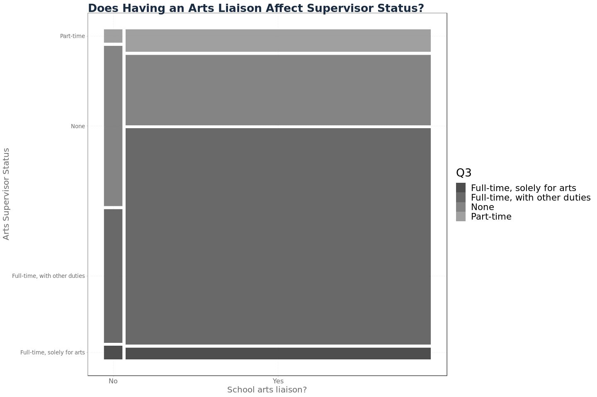

NYC Schools Arts Survey Data
----------------------------

The [2017-2018 Arts Survey
Data](https://data.cityofnewyork.us/Education/2017-2018-Arts-Survey-Data/475h-cg5t)
has data about arts teachers, budgets, partnerships with cultural
organizations and parental involvement in NYC public schools.

In an effort to gain greater context for this data, we can examine it in
conjuction with publicly available [ELA and Math state test
results](https://infohub.nyced.org/reports-and-policies/citywide-information-and-data/test-results)
and [demographic
data](https://data.cityofnewyork.us/Education/2013-2018-Demographic-Snapshot-School/s52a-8aq6).

My goals were to understand the state of arts programs in NYC schools,
what variables affect the resources of arts programs, and whether arts
programs have an effect on the academic performance of students.

### Arts Education Liaison

In 2018, 1265 schools were surveyed. Schools were asked whether they
have a designated arts supervisor. 5.6%, 72 schools, had no arts
supervisor. My first question has to do with whether there is any
relation between the presence of an arts supervisor and the demographics
of the student population.

Schools without a designated arts supervisor appear to have more black
students than those with supervisors (Fig 4). There appear to be several
schools withan arts supervisor and very high poverty, but there is no
clear relation (Fig 2). I also do not see a significant relation between
total enrollment (Fig 1) or student gender ratio (Fig 3) and having an
arts supervisor. Most schools have about 500 students and gender splits
close to 50-50 so a small difference would be hard to detect in these
graphs.

In order to assess the significance of the differences pointed we see
above, we can try to fit a logistic regression to the relationship
between each variable and the binary response "Does the school have an
an arts supervisor?"

These regressions lend support to the differences spotted in the plots
of student poverty and race, but the most statistically significant
coefficient comes from total enrollment. The coefficient for total
enrollment is negative with a p-value below a significance level of
0.001. Percentages of impoverished and black students have positive
coefficients with p-values below a significance level of 0.01. As we had
assumed from the graphs, there was no significant relation between
gender and whether a school had an arts supervisor.  
In order to better interpret these results I converted the standard R
logistic regression coefficients into relative risk, [as seen
here](https://www.bmj.com/content/348/bmj.f7450.full?ijkey=NHT1YVsoX1RCm8r&keytype=ref).

    ## $total_enrollment_2017
    ## [1] 0.9975802
    ## 
    ## $perc_pov_2017
    ## [1] 1.021338
    ## 
    ## $perc_black_2017
    ## [1] 1.012599

An increase in total enrollment of one student is associated with a .25%
decrease in the likelihood that a school has an arts supervisor. An
increase of one percentage point in student poverty and in share of
black students is associated with 2.13% and 1.26% increases,
respectively, in the likelihood that a school has an arts supervisor.

Consider the possibility that there is confounding between these
variables, ie. small schools tend to serve poor, mostly black student
populations. To address this possibility I ran a logistic regression
upon total enrollment, student poverty and share of black students. This
yielded only one significant feature, total enrollment, supporting some
sort of statistical interdependence between the variables.  
Let S denote school art supervisor, E enrollment, P poverty and B black
students.

To further investigate confounding, I ran a linear model for total
enrollment on percentage of impoverished and black students. As
suspected, both had negative relationships with total enrollment. In
particular, with a p-value less than significance level 0.001, each
additional percentage point of black students was associated with a
decrease of 5.22 students.

As a former NYC public school student this coincides with my experience
of the school system. In my old neighborhood of Canarsie in Brooklyn was
a school previously known as South Shore High School. It served
thousands of poor, majority minority students. In 2010, the school was
converted into the [South Shore Educational
Complex](https://insideschools.org/school/18K515) and now houses five
smaller high schools. A naive observer could be expected to assume that
small schools have higher faculty:student ratios and more resources to
expend on their students. In reality the policies of the NYC DOE have
led to the exact opposite, with underperforming schools split up without
necessarily being given the resources to turn around their performance.

My second question is whether there is any relation between having an
arts supervisor and student academic performance.

    ## 
    ## Call:
    ## lm(formula = perc_34_all_2018_ela ~ ., data = .)
    ## 
    ## Residuals:
    ##     Min      1Q  Median      3Q     Max 
    ## -46.914 -16.395  -3.014  15.136  62.224 
    ## 
    ## Coefficients:
    ##             Estimate Std. Error t value Pr(>|t|)    
    ## (Intercept)  46.9138     0.6966  67.346  < 2e-16 ***
    ## Q2_1        -11.0378     2.9472  -3.745 0.000192 ***
    ## ---
    ## Signif. codes:  0 '***' 0.001 '**' 0.01 '*' 0.05 '.' 0.1 ' ' 1
    ## 
    ## Residual standard error: 20.25 on 893 degrees of freedom
    ##   (370 observations deleted due to missingness)
    ## Multiple R-squared:  0.01546,    Adjusted R-squared:  0.01436 
    ## F-statistic: 14.03 on 1 and 893 DF,  p-value: 0.0001918

    ## 
    ## Call:
    ## lm(formula = perc_34_all_2018_ela ~ ., data = .)
    ## 
    ## Residuals:
    ##     Min      1Q  Median      3Q     Max 
    ## -33.682  -9.306  -1.539   7.298  53.259 
    ## 
    ## Coefficients:
    ##                        Estimate Std. Error t value Pr(>|t|)    
    ## (Intercept)           94.734711   1.802482  52.558  < 2e-16 ***
    ## Q2_1                  -2.866684   1.844428  -1.554 0.120483    
    ## perc_pov_2017         -0.638242   0.020032 -31.860  < 2e-16 ***
    ## perc_black_2017       -0.119648   0.017993  -6.650 5.12e-11 ***
    ## total_enrollment_2017  0.004533   0.001353   3.350 0.000843 ***
    ## ---
    ## Signif. codes:  0 '***' 0.001 '**' 0.01 '*' 0.05 '.' 0.1 ' ' 1
    ## 
    ## Residual standard error: 12.49 on 890 degrees of freedom
    ##   (370 observations deleted due to missingness)
    ## Multiple R-squared:  0.6267, Adjusted R-squared:  0.625 
    ## F-statistic: 373.5 on 4 and 890 DF,  p-value: < 2.2e-16

    ## 
    ## Call:
    ## lm(formula = perc_34_all_2018_math ~ ., data = .)
    ## 
    ## Residuals:
    ##     Min      1Q  Median      3Q     Max 
    ## -43.595 -18.795  -4.495  16.955  68.652 
    ## 
    ## Coefficients:
    ##             Estimate Std. Error t value Pr(>|t|)    
    ## (Intercept)  43.5953     0.7969  54.705  < 2e-16 ***
    ## Q2_1        -14.0473     3.3716  -4.166  3.4e-05 ***
    ## ---
    ## Signif. codes:  0 '***' 0.001 '**' 0.01 '*' 0.05 '.' 0.1 ' ' 1
    ## 
    ## Residual standard error: 23.17 on 893 degrees of freedom
    ##   (370 observations deleted due to missingness)
    ## Multiple R-squared:  0.01907,    Adjusted R-squared:  0.01797 
    ## F-statistic: 17.36 on 1 and 893 DF,  p-value: 3.397e-05

    ## 
    ## Call:
    ## lm(formula = perc_34_all_2018_math ~ ., data = .)
    ## 
    ## Residuals:
    ##     Min      1Q  Median      3Q     Max 
    ## -40.137 -10.644  -2.267   8.213  63.174 
    ## 
    ## Coefficients:
    ##                        Estimate Std. Error t value Pr(>|t|)    
    ## (Intercept)           92.029270   2.178865  42.237  < 2e-16 ***
    ## Q2_1                  -4.442436   2.229570  -1.993   0.0466 *  
    ## perc_pov_2017         -0.629027   0.024215 -25.976  < 2e-16 ***
    ## perc_black_2017       -0.219982   0.021750 -10.114  < 2e-16 ***
    ## total_enrollment_2017  0.006570   0.001636   4.016 6.42e-05 ***
    ## ---
    ## Signif. codes:  0 '***' 0.001 '**' 0.01 '*' 0.05 '.' 0.1 ' ' 1
    ## 
    ## Residual standard error: 15.1 on 890 degrees of freedom
    ##   (370 observations deleted due to missingness)
    ## Multiple R-squared:  0.5847, Adjusted R-squared:  0.5828 
    ## F-statistic: 313.2 on 4 and 890 DF,  p-value: < 2.2e-16

To measure academic performance, we can use the percentage of students
to receive a 3 or 4 on state standardized tests (grades corresponding to
at or above expectations), denoted `perc_34`. If we consider the
relationship between having an arts supervisor and academic performance,
then we see an 11 and 14 point decrease in English Language Arts (ELA)
and math, respectively, at a significance level less than 0.001.  
However, considering the causal relationship above, we can introduce
context by conditioning on student poverty, share of black students, and
total enrollment. In this case we do not have any statistically
significant relation with ELA scores and a four point decrease in math
scores, but at a 0.04 significance level.

Next time, I will continue going through the survey. The presence of an
arts supervisor does not necessarily equate to a well-resourced and
efficacious arts program, so I hope to find some interesting questions.

Part 2
------

### Arts Supervisors

New York City public schools were asked whether their arts supervisor
was employed full- or part-time. If their supervisor was full-time,
schools clarified whether they were solely working on arts programs or
had other responsibilities.  
In small schools, or under-resourced ones, faculty may be expected to
wear many hats. In the simplest cases, physical education teachers lead
gym and health classes. More extreme examples can have teachers with
certification in, for example, English teaching classes in math or
science. I do not assert that an arts supervisor *must* be employed
full-time to run an effective program, but I am curious as to what
features predict their employment status.

There are many full-time supervisors with duties other than the arts. I
would be curious to discover the share of their responsibilities that
are considered "other". It is possible that some administrators consider
teaching an arts class or doing clerical work to be "other". Relative to
the number of supervisors working full-time, there are few part-timers.

Only two schools did not respond to this question about their arts
supervisor's status. In the previous
[part](https://ecboxer.github.io/eda/art_education/arts_survey_1.html),
I looked at the question of whether a school had a designated arts
liaison. 72 schools responded that they did not, while 296 schools do
not have any arts supervisor. I wonder whether the presence of an arts
supervisor has more or less influence on student academic performance,
relative to arts liaisons.

To begin exploring academic performance, I will use the percentage of
students to perform at or above standards for English Language Arts
(ELA) and math.

I came into this analysis with some suspicion that arts programs might
be more beneficial for ELA performance than for math, if they were to
have any effect. In the plot above there is a positive relationship
between ELA and math scores, regardless of art supervisor status.

    ## 
    ## Call:
    ## lm(formula = Math_score ~ ., data = .)
    ## 
    ## Residuals:
    ##     Min      1Q  Median      3Q     Max 
    ## -32.578  -4.957   0.679   5.235  32.163 
    ## 
    ## Coefficients:
    ##             Estimate Std. Error t value Pr(>|t|)    
    ## (Intercept) -6.45658    0.72046  -8.962   <2e-16 ***
    ## ELA_score    1.06415    0.01424  74.718   <2e-16 ***
    ## ---
    ## Signif. codes:  0 '***' 0.001 '**' 0.01 '*' 0.05 '.' 0.1 ' ' 1
    ## 
    ## Residual standard error: 8.686 on 893 degrees of freedom
    ##   (370 observations deleted due to missingness)
    ## Multiple R-squared:  0.8621, Adjusted R-squared:  0.8619 
    ## F-statistic:  5583 on 1 and 893 DF,  p-value: < 2.2e-16

#### Output 1

On inspection the relation between the two scores seems identical
between supervisor statuses. In fact, fitting a linear regression to
each yields coefficients close to the uncontrolled coefficient for math
scores on ELA scores, 1.06415 (Output 1).
*M**a**t**h*\_*s**c**o**r**e* = *β*0 + *β*1 \* *E**L**A*\_*s**c**o**r**e*

    ## 
    ## Call:
    ## lm(formula = Math_score ~ ., data = .)
    ## 
    ## Residuals:
    ##     Min      1Q  Median      3Q     Max 
    ## -32.854  -4.955   0.520   5.357  31.868 
    ## 
    ## Coefficients:
    ##              Estimate Std. Error t value Pr(>|t|)    
    ## (Intercept) -20.80595    8.66873  -2.400   0.0166 *  
    ## Q3_1         10.11455    8.84006   1.144   0.2529    
    ## Q3_2         14.62550    8.66724   1.687   0.0919 .  
    ## Q3_3         13.37116    8.73705   1.530   0.1263    
    ## Q3_4         14.28427    8.68146   1.645   0.1002    
    ## ELA_score     1.06450    0.01421  74.922   <2e-16 ***
    ## ---
    ## Signif. codes:  0 '***' 0.001 '**' 0.01 '*' 0.05 '.' 0.1 ' ' 1
    ## 
    ## Residual standard error: 8.657 on 889 degrees of freedom
    ##   (370 observations deleted due to missingness)
    ## Multiple R-squared:  0.8636, Adjusted R-squared:  0.8628 
    ## F-statistic:  1126 on 5 and 889 DF,  p-value: < 2.2e-16

#### Output 2

We can control for supervisor status with dummy variables by altering
the regression like so,
*M**a**t**h*\_*s**c**o**r**e* = *β*0 + *β*1 \* *E**L**A*\_*s**c**o**r**e* + *β*2 \* *Q*3\_1 + *β*3 \* *Q*3\_2 + *β*4 \* *Q*3\_3 + *β*5 \* *Q*3\_4,
where *Q*3\_*i* corresponds to the *i**t**h* member of the
list
`c('Full-time, solely for arts', 'Full-time, with other duties', 'Part-time', 'None')`
(Output 2).

    ##                  2.5 %    97.5 %
    ## (Intercept) -37.819514 -3.792379
    ## Q3_1         -7.235276 27.464384
    ## Q3_2         -2.385138 31.636142
    ## Q3_3         -3.776499 30.518809
    ## Q3_4         -2.754271 31.322808
    ## ELA_score     1.036615  1.092385

#### Output 3

This model specification does not result in a compellingly significant
coefficient for the effect of a particular supervisor status. Any status
is estimated to have a positive coefficient, but a 95% confidence
interval (Output 3) does not exclude the possibility that any of status
coefficients could be zero.

    delta.beta1 <- coefficients(lm.fit.null.summ)[2,1] - coefficients(lm.fit.summ)[6,1]
    delta.beta1

    ## [1] -0.0003517423

    se.delta.beta1 <- sqrt(coefficients(lm.fit.null.summ)[2,2]^2 + coefficients(lm.fit.summ)[6,2]^2)
    se.delta.beta1

    ## [1] 0.02011739

#### Output 4

On inspection, the regression coefficients for `ELA_score` are close
between model specifications A (no controls) and B (controlling for
supervisor status). The difference in estimated coefficients
*β*1 is -0.0003 (Output 4). To find the variability of the
difference in regression coefficients, we use the formula
*V**a**r*(*A* − *B*)=*V**a**r*(*A*)+*V**a**r*(*B*)−2 \* *C**o**v*(*A*, *B*).
Assuming covariance between the two estimates is zero, we arrive at
0.0201 as the standard error of the difference.  
Now I can assert that there is no difference in the relationsip between
ELA and math scores from supervisor statuses.

This mosaic plot illustrates that the proportion of schools without an
arts program supervisor is greater for schools without an arts liaison
that for those with. This lends support to the idea that those schools
are lacking the resources to fully staff their arts programs, as they
have not filled two key positions. It is of course possible that arts
liaisons and supervisors are not necessary to effective programs, and
schools without either are running just fine. I would like to assess the
quality of the arts programs themselves as a function their liaison and
supervisor statuses, perhaps through some sort of measure of funding or
arts resources.

------------------------------------------------------------------------

The next questions concern certifications that arts supervisors may
have, either in an arts discipline or in administration.

Few supervisors are certified in the arts, the majority are
administrators. Could this have an impact on the efficacy of an arts
program?

Linear regressions do not yield a statistically significant result for
the effect of either or both supervisor certification on student
academic performance. The model specifications I tried out were of the
form
*s**c**o**r**e* = *β*0 + *β*1 \* *a**r**t**s*\_*c**e**r**t* + *β*2 \* *a**d**m**i**n*\_*c**e**r**t* + *β*3 \* *b**o**t**h*\_*c**e**r**t*.

    ## 
    ## Call:
    ## lm(formula = perc_34_all_2018_ela ~ ., data = .)
    ## 
    ## Residuals:
    ##     Min      1Q  Median      3Q     Max 
    ## -32.521  -9.023  -1.700   7.244  54.364 
    ## 
    ## Coefficients:
    ##                        Estimate Std. Error t value Pr(>|t|)    
    ## (Intercept)           93.980634   1.850377  50.790  < 2e-16 ***
    ## arts_cert              1.164997   1.758245   0.663 0.507765    
    ## admin_cert             1.167456   0.942800   1.238 0.215937    
    ## both_cert              1.002057   2.934071   0.342 0.732789    
    ## total_enrollment_2017  0.004566   0.001363   3.351 0.000839 ***
    ## perc_black_2017       -0.119051   0.018022  -6.606  6.8e-11 ***
    ## perc_pov_2017         -0.642529   0.020084 -31.993  < 2e-16 ***
    ## ---
    ## Signif. codes:  0 '***' 0.001 '**' 0.01 '*' 0.05 '.' 0.1 ' ' 1
    ## 
    ## Residual standard error: 12.5 on 888 degrees of freedom
    ##   (370 observations deleted due to missingness)
    ## Multiple R-squared:  0.6268, Adjusted R-squared:  0.6243 
    ## F-statistic: 248.6 on 6 and 888 DF,  p-value: < 2.2e-16

    ##                              2.5 %       97.5 %
    ## (Intercept)           90.349011532 97.612257433
    ## arts_cert             -2.285803835  4.615797128
    ## admin_cert            -0.682920159  3.017833144
    ## both_cert             -4.756465157  6.760580155
    ## total_enrollment_2017  0.001891955  0.007240283
    ## perc_black_2017       -0.154420668 -0.083680879
    ## perc_pov_2017         -0.681945909 -0.603112479

    ## 
    ## Call:
    ## lm(formula = perc_34_all_2018_math ~ ., data = .)
    ## 
    ## Residuals:
    ##     Min      1Q  Median      3Q     Max 
    ## -41.852 -10.756  -2.115   8.057  63.109 
    ## 
    ## Coefficients:
    ##                        Estimate Std. Error t value Pr(>|t|)    
    ## (Intercept)           91.616504   2.239070  40.917  < 2e-16 ***
    ## arts_cert             -1.728792   2.127584  -0.813    0.417    
    ## admin_cert             0.942806   1.140846   0.826    0.409    
    ## both_cert              3.165637   3.550406   0.892    0.373    
    ## total_enrollment_2017  0.006623   0.001649   4.017  6.4e-05 ***
    ## perc_black_2017       -0.219876   0.021807 -10.083  < 2e-16 ***
    ## perc_pov_2017         -0.634167   0.024302 -26.095  < 2e-16 ***
    ## ---
    ## Signif. codes:  0 '***' 0.001 '**' 0.01 '*' 0.05 '.' 0.1 ' ' 1
    ## 
    ## Residual standard error: 15.13 on 888 degrees of freedom
    ##   (370 observations deleted due to missingness)
    ## Multiple R-squared:  0.584,  Adjusted R-squared:  0.5812 
    ## F-statistic: 207.8 on 6 and 888 DF,  p-value: < 2.2e-16

    ##                              2.5 %       97.5 %
    ## (Intercept)           87.222017963 96.010989772
    ## arts_cert             -5.904471567  2.446887747
    ## admin_cert            -1.296263104  3.181874756
    ## both_cert             -3.802527434 10.133801854
    ## total_enrollment_2017  0.003386955  0.009858758
    ## perc_black_2017       -0.262675858 -0.177076386
    ## perc_pov_2017         -0.681863289 -0.586470017

#### Output 5

After controlling for school size and percentage of black and
impoverished students, there is no statistically significant effect for
certifications on academic performance. A 95% confidence interval of the
coefficient for supervisor certification in administration includes zero
for ELA and math scores, so we cannot claim that there is a
statistically significant nonzero effect on academic performance. The
confidence interval for arts or both certifications are even wider.

    ## 
    ## Call:
    ## lm(formula = perc_4_all_2018_ela ~ ., data = .)
    ## 
    ## Residuals:
    ##     Min      1Q  Median      3Q     Max 
    ## -29.574  -5.502  -1.417   3.625  57.556 
    ## 
    ## Coefficients:
    ##                        Estimate Std. Error t value Pr(>|t|)    
    ## (Intercept)           48.868172   1.405134  34.778  < 2e-16 ***
    ## arts_cert              0.862021   1.335171   0.646    0.519    
    ## admin_cert             0.543582   0.715941   0.759    0.448    
    ## both_cert              3.240655   2.228066   1.454    0.146    
    ## total_enrollment_2017  0.005410   0.001035   5.229 2.13e-07 ***
    ## perc_black_2017       -0.054557   0.013685  -3.987 7.25e-05 ***
    ## perc_pov_2017         -0.453225   0.015251 -29.718  < 2e-16 ***
    ## ---
    ## Signif. codes:  0 '***' 0.001 '**' 0.01 '*' 0.05 '.' 0.1 ' ' 1
    ## 
    ## Residual standard error: 9.494 on 888 degrees of freedom
    ##   (370 observations deleted due to missingness)
    ## Multiple R-squared:  0.5861, Adjusted R-squared:  0.5833 
    ## F-statistic: 209.5 on 6 and 888 DF,  p-value: < 2.2e-16

    ##                              2.5 %       97.5 %
    ## (Intercept)           46.110400736 51.625943358
    ## arts_cert             -1.758437940  3.482479797
    ## admin_cert            -0.861551453  1.948715865
    ## both_cert             -1.132235198  7.613545292
    ## total_enrollment_2017  0.003379317  0.007440715
    ## perc_black_2017       -0.081416450 -0.027698274
    ## perc_pov_2017         -0.483157590 -0.423293288

    ## 
    ## Call:
    ## lm(formula = perc_4_all_2018_math ~ ., data = .)
    ## 
    ## Residuals:
    ##     Min      1Q  Median      3Q     Max 
    ## -35.383  -7.853  -2.417   5.387  58.260 
    ## 
    ## Coefficients:
    ##                        Estimate Std. Error t value Pr(>|t|)    
    ## (Intercept)           59.773655   1.820197  32.839  < 2e-16 ***
    ## arts_cert             -1.894760   1.729567  -1.096 0.273590    
    ## admin_cert             0.277532   0.927423   0.299 0.764818    
    ## both_cert              5.689689   2.886215   1.971 0.048996 *  
    ## total_enrollment_2017  0.005234   0.001340   3.905 0.000101 ***
    ## perc_black_2017       -0.154016   0.017728  -8.688  < 2e-16 ***
    ## perc_pov_2017         -0.508582   0.019756 -25.743  < 2e-16 ***
    ## ---
    ## Signif. codes:  0 '***' 0.001 '**' 0.01 '*' 0.05 '.' 0.1 ' ' 1
    ## 
    ## Residual standard error: 12.3 on 888 degrees of freedom
    ##   (370 observations deleted due to missingness)
    ## Multiple R-squared:  0.5648, Adjusted R-squared:  0.5619 
    ## F-statistic: 192.1 on 6 and 888 DF,  p-value: < 2.2e-16

    ##                              2.5 %       97.5 %
    ## (Intercept)           56.201265512 63.346043902
    ## arts_cert             -5.289275597  1.499756483
    ## admin_cert            -1.542663701  2.097728293
    ## both_cert              0.025091309 11.354287317
    ## total_enrollment_2017  0.002603756  0.007864849
    ## perc_black_2017       -0.188808711 -0.119222727
    ## perc_pov_2017         -0.547356080 -0.469808466

#### Output 6

If we drill down further, looking at only the percentage of students to
receive a 4 (the highest grade), then there is a statistically
significant coefficient for the effect of both certifications on math
scores, with a p-value of 0.048996 (Output 6). In this case, a 95%
confidence interval just excludes zero, being \[0.025, 11.354\].  
Having been able to arrive at this more tenuous result I feel a renewed
belief that arts programs do have an effect on academic performance and
that some proof is lying in the data somewhere. On the other hand I am
suspicious as to how I *manufactured* this result by narrowing my focus
until I hacked my way to an accceptable p-value.

Data Provenance
---------------

The [2017-2018 Arts Survey
Data](https://data.cityofnewyork.us/Education/2017-2018-Arts-Survey-Data/475h-cg5t)
has data about arts teachers, budgets, partnerships with cultural
organizations and parental involvement in NYC public schools.

In an effort to gain greater context for this data, I have examined it
in conjuction with publicly available [ELA and Math state test
results](https://infohub.nyced.org/reports-and-policies/citywide-information-and-data/test-results)
and [demographic
data](https://data.cityofnewyork.us/Education/2013-2018-Demographic-Snapshot-School/s52a-8aq6).

My goals are to understand the state of arts programs in NYC schools,
what variables affect the resources of arts programs, and whether arts
programs have an effect on the academic performance of students.

Part 3
------

### Resources devoted to arts education

This is part of an extended look at the NYC School Arts Survey:  
[Part One: Arts Education
Liaisons](https://ecboxer.github.io/eda/art_education/arts_survey_1.html)  
[Part Two: Arts Education
Supervisors](https://ecboxer.github.io/eda/art_education/arts_survey_2.html)

The survey had several questions regarding which resources schools are
devoting to arts education, whether the administrator thought they were
sufficient and which non-Department of Education sources of support were
available to them.

Schools were asked how many rooms they have dedicated to arts education.
Rooms were divided into two categories: "rooms designed and used solely
for the arts" and "multi-purpose or general education classroooms used
for arts education". Five arts disciplines were considered: dance,
music, theater, visual arts, and media arts (a category which includes
film and photography). Note that the term media arts refers to film
programs.  
Number of rooms is certainly not a direct metric for a school's
commitment to the arts. I hypothesize that it may prove useful for
assessing the resources that are made available for arts education more
broadly. Of course, there may be confounding factors, such as school
size and borough.

All disciplines show the same trend; many schools have zero to two rooms
for a given discipline and a few schools have more than twenty rooms.
Having twenty-some rooms might be bordering on unrealistic, but the
above plots depict both categories of rooms, those designed solely for
the arts and multi-purpose. Will we get more reasonable numbers by
examining the room counts separately?

Looking at the number of rooms designed solely for the arts, the maximum
number of rooms is a more reasonable thirteen. For a school with several
hundred students and a dedicated arts program I can picture that. If we
look at multi-purpose rooms, we see that this class contains the bulk of
the rooms. Not many schools have dozens of multi-purpose rooms for arts
disciplines, but again, in the context of a large school, it seems like
a possible number for some schools to have.  
I would be curious to discover the overlap for multi-purpose rooms among
arts disciplines. In other words, is a school with twenty multi-purpose
rooms reporting some of those rooms as in use for multiple arts
discipline? I do not see any way to completely correct for that
possibility, but it would be interesting to control for school size to
try to get to the bottom of it. If this does not work, then we could
consider only the number of rooms designed solely for art, but this
could penalize small schools unduly.

    ## 
    ## Call:
    ## lm(formula = perc_34_all_2018_ela ~ ., data = .)
    ## 
    ## Residuals:
    ##     Min      1Q  Median      3Q     Max 
    ## -38.706 -15.286  -3.482  13.757  57.410 
    ## 
    ## Coefficients:
    ##                        Estimate Std. Error t value Pr(>|t|)    
    ## (Intercept)           37.172301   1.540811  24.125  < 2e-16 ***
    ## dance_rooms            0.198147   0.203517   0.974    0.331    
    ## music_rooms           -0.019724   0.170177  -0.116    0.908    
    ## theater_rooms         -0.046773   0.195201  -0.240    0.811    
    ## visual_arts_rooms      0.186354   0.137639   1.354    0.176    
    ## media_arts_rooms      -0.141977   0.162441  -0.874    0.382    
    ## total_enrollment_2017  0.014001   0.002242   6.245 7.33e-10 ***
    ## ---
    ## Signif. codes:  0 '***' 0.001 '**' 0.01 '*' 0.05 '.' 0.1 ' ' 1
    ## 
    ## Residual standard error: 19.62 on 706 degrees of freedom
    ##   (552 observations deleted due to missingness)
    ## Multiple R-squared:  0.06461,    Adjusted R-squared:  0.05666 
    ## F-statistic: 8.127 on 6 and 706 DF,  p-value: 1.642e-08

    ## 
    ## Call:
    ## lm(formula = perc_34_all_2018_math ~ ., data = .)
    ## 
    ## Residuals:
    ##     Min      1Q  Median      3Q     Max 
    ## -44.704 -17.891  -4.972  15.429  60.377 
    ## 
    ## Coefficients:
    ##                        Estimate Std. Error t value Pr(>|t|)    
    ## (Intercept)           30.379442   1.751426  17.346  < 2e-16 ***
    ## dance_rooms            0.187916   0.231335   0.812   0.4169    
    ## music_rooms            0.142808   0.193439   0.738   0.4606    
    ## theater_rooms          0.048594   0.221883   0.219   0.8267    
    ## visual_arts_rooms      0.258630   0.156453   1.653   0.0988 .  
    ## media_arts_rooms      -0.206618   0.184645  -1.119   0.2635    
    ## total_enrollment_2017  0.018216   0.002549   7.147 2.21e-12 ***
    ## ---
    ## Signif. codes:  0 '***' 0.001 '**' 0.01 '*' 0.05 '.' 0.1 ' ' 1
    ## 
    ## Residual standard error: 22.3 on 706 degrees of freedom
    ##   (552 observations deleted due to missingness)
    ## Multiple R-squared:  0.09644,    Adjusted R-squared:  0.08876 
    ## F-statistic: 12.56 on 6 and 706 DF,  p-value: 1.747e-13

Conditioning on the effect of school size, through total enrollment,
there is no statistically significant effect for the total number of
rooms for arts education on student academic performance.

    ## 
    ## Call:
    ## lm(formula = perc_34_all_2018_ela ~ ., data = .)
    ## 
    ## Residuals:
    ##     Min      1Q  Median      3Q     Max 
    ## -39.233 -15.704  -3.011  13.495  54.952 
    ## 
    ## Coefficients:
    ##                       Estimate Std. Error t value Pr(>|t|)    
    ## (Intercept)           36.98124    1.56537  23.625  < 2e-16 ***
    ## Q8_R1_C1              -1.92913    1.36332  -1.415 0.157452    
    ## Q8_R2_C1               3.30383    0.91647   3.605 0.000332 ***
    ## Q8_R3_C1               0.92597    1.04167   0.889 0.374312    
    ## Q8_R4_C1               0.16888    1.18807   0.142 0.886998    
    ## Q8_R5_C1              -1.84882    1.00594  -1.838 0.066449 .  
    ## total_enrollment_2017  0.01312    0.00221   5.938  4.3e-09 ***
    ## ---
    ## Signif. codes:  0 '***' 0.001 '**' 0.01 '*' 0.05 '.' 0.1 ' ' 1
    ## 
    ## Residual standard error: 19.51 on 797 degrees of freedom
    ##   (461 observations deleted due to missingness)
    ## Multiple R-squared:  0.08419,    Adjusted R-squared:  0.0773 
    ## F-statistic: 12.21 on 6 and 797 DF,  p-value: 3.603e-13

    ## 
    ## Call:
    ## lm(formula = perc_34_all_2018_math ~ ., data = .)
    ## 
    ## Residuals:
    ##     Min      1Q  Median      3Q     Max 
    ## -39.170 -17.415  -4.067  14.767  58.385 
    ## 
    ## Coefficients:
    ##                        Estimate Std. Error t value Pr(>|t|)    
    ## (Intercept)           31.887968   1.772957  17.986  < 2e-16 ***
    ## Q8_R1_C1              -3.390478   1.544105  -2.196   0.0284 *  
    ## Q8_R2_C1               2.964480   1.037997   2.856   0.0044 ** 
    ## Q8_R3_C1               0.795531   1.179807   0.674   0.5003    
    ## Q8_R4_C1              -0.890543   1.345613  -0.662   0.5083    
    ## Q8_R5_C1              -2.400571   1.139337  -2.107   0.0354 *  
    ## total_enrollment_2017  0.019294   0.002503   7.707 3.82e-14 ***
    ## ---
    ## Signif. codes:  0 '***' 0.001 '**' 0.01 '*' 0.05 '.' 0.1 ' ' 1
    ## 
    ## Residual standard error: 22.1 on 797 degrees of freedom
    ##   (461 observations deleted due to missingness)
    ## Multiple R-squared:  0.104,  Adjusted R-squared:  0.09722 
    ## F-statistic: 15.41 on 6 and 797 DF,  p-value: < 2.2e-16

Controlling for school size, through total student enrollment, we can
see a statistically significant (p-value less than 0.001) positive
coefficient for the effect of additional rooms designed and used solely
for music, on ELA state test scores. If we consider math scores, rooms
solely dedicated to music still have a positive effect, but at a 0.0044
p-value. No other arts disciplines have a statistically significant
effect on ELA scores, but dance and media arts rooms have statistically
significant (p-value less than 0.05) negative effects on math scores.  
When we consider multi-purpose rooms, no arts discipline has a
statistically significant effect on academic performance.  
I am curious about the reason behind why music rooms appear to be
associated with higher test scores, and why dance and media arts are
associated with lower scores. To investigate we can try to control for
different features and divide the performance metric by grade.

    ## [1] "perc_34_5_2018_ela"
    ## 
    ## Call:
    ## lm(formula = f.ela, data = .)
    ## 
    ## Residuals:
    ##     Min      1Q  Median      3Q     Max 
    ## -37.072 -16.524  -3.894  15.154  65.915 
    ## 
    ## Coefficients:
    ##                        Estimate Std. Error t value Pr(>|t|)    
    ## (Intercept)           30.393260   2.172697  13.989  < 2e-16 ***
    ## total_enrollment_2017  0.010224   0.002857   3.579 0.000375 ***
    ## Q8_R1_C1              -1.070094   1.677094  -0.638 0.523694    
    ## Q8_R2_C1               3.047105   1.061100   2.872 0.004239 ** 
    ## Q8_R3_C1              -0.076777   1.189206  -0.065 0.948546    
    ## Q8_R4_C1              -0.120480   1.501049  -0.080 0.936057    
    ## Q8_R5_C1              -0.440556   1.291528  -0.341 0.733148    
    ## ---
    ## Signif. codes:  0 '***' 0.001 '**' 0.01 '*' 0.05 '.' 0.1 ' ' 1
    ## 
    ## Residual standard error: 20.13 on 556 degrees of freedom
    ## Multiple R-squared:  0.04519,    Adjusted R-squared:  0.03489 
    ## F-statistic: 4.386 on 6 and 556 DF,  p-value: 0.000242
    ## 
    ## [1] "perc_34_6_2018_ela"
    ## 
    ## Call:
    ## lm(formula = f.ela, data = .)
    ## 
    ## Residuals:
    ##     Min      1Q  Median      3Q     Max 
    ## -41.030 -16.090  -3.834  12.920  55.424 
    ## 
    ## Coefficients:
    ##                        Estimate Std. Error t value Pr(>|t|)    
    ## (Intercept)           32.107149   2.400189  13.377  < 2e-16 ***
    ## total_enrollment_2017  0.019201   0.003511   5.469 9.17e-08 ***
    ## Q8_R1_C1              -0.386109   2.053572  -0.188  0.85098    
    ## Q8_R2_C1               2.890346   1.386475   2.085  0.03789 *  
    ## Q8_R3_C1               3.378799   2.188257   1.544  0.12357    
    ## Q8_R4_C1               1.694171   1.881632   0.900  0.36860    
    ## Q8_R5_C1              -4.765419   1.542141  -3.090  0.00218 ** 
    ## ---
    ## Signif. codes:  0 '***' 0.001 '**' 0.01 '*' 0.05 '.' 0.1 ' ' 1
    ## 
    ## Residual standard error: 20.26 on 319 degrees of freedom
    ## Multiple R-squared:  0.1908, Adjusted R-squared:  0.1756 
    ## F-statistic: 12.53 on 6 and 319 DF,  p-value: 1.08e-12

    ## [1] "perc_34_5_2018_math"
    ## 
    ## Call:
    ## lm(formula = f.math, data = .)
    ## 
    ## Residuals:
    ##     Min      1Q  Median      3Q     Max 
    ## -42.241 -19.010  -3.535  16.810  65.205 
    ## 
    ## Coefficients:
    ##                        Estimate Std. Error t value Pr(>|t|)    
    ## (Intercept)           30.370138   2.450852  12.392  < 2e-16 ***
    ## total_enrollment_2017  0.015948   0.003225   4.944 1.01e-06 ***
    ## Q8_R1_C1              -1.021941   1.892332  -0.540 0.589384    
    ## Q8_R2_C1               3.959590   1.195636   3.312 0.000988 ***
    ## Q8_R3_C1              -0.436070   1.340461  -0.325 0.745066    
    ## Q8_R4_C1              -1.058457   1.691447  -0.626 0.531723    
    ## Q8_R5_C1              -0.904146   1.456523  -0.621 0.535015    
    ## ---
    ## Signif. codes:  0 '***' 0.001 '**' 0.01 '*' 0.05 '.' 0.1 ' ' 1
    ## 
    ## Residual standard error: 22.68 on 555 degrees of freedom
    ## Multiple R-squared:  0.07056,    Adjusted R-squared:  0.06051 
    ## F-statistic: 7.023 on 6 and 555 DF,  p-value: 3.232e-07
    ## 
    ## [1] "perc_34_6_2018_math"
    ## 
    ## Call:
    ## lm(formula = f.math, data = .)
    ## 
    ## Residuals:
    ##     Min      1Q  Median      3Q     Max 
    ## -48.190 -16.714  -4.699  10.401  67.053 
    ## 
    ## Coefficients:
    ##                        Estimate Std. Error t value Pr(>|t|)    
    ## (Intercept)           18.231937   2.592891   7.032 1.25e-11 ***
    ## total_enrollment_2017  0.021830   0.003808   5.733 2.29e-08 ***
    ## Q8_R1_C1              -0.022742   2.227755  -0.010  0.99186    
    ## Q8_R2_C1               3.955813   1.502217   2.633  0.00887 ** 
    ## Q8_R3_C1               2.114419   2.368073   0.893  0.37259    
    ## Q8_R4_C1               2.738886   2.038702   1.343  0.18008    
    ## Q8_R5_C1              -4.635148   1.673390  -2.770  0.00594 ** 
    ## ---
    ## Signif. codes:  0 '***' 0.001 '**' 0.01 '*' 0.05 '.' 0.1 ' ' 1
    ## 
    ## Residual standard error: 21.97 on 319 degrees of freedom
    ## Multiple R-squared:  0.218,  Adjusted R-squared:  0.2033 
    ## F-statistic: 14.82 on 6 and 319 DF,  p-value: 5.957e-15

If we break down academic performance by grade, then the results are not
as straigtforward. For sixth-, seventh- and eighth-graders' ELA
performance, media arts rooms have a more statistically significant
negative coefficient than the positive coefficient for music rooms. All
grades show a positive coefficient for music rooms, with a p-value no
more than 0.01. There is a large jump in media arts between fifth- and
sixth-grades, which is the demarcation between elementary and middle
schools. A jump of this nature could have an underlying reason, beyond
increased susceptibility to media arts programs at the expense of
academic performance beginning in middle school. Perhaps not many
elementary schools have media arts programs at all, or they are more
commonly found in schools that are otherwise performing at an atypical
level (higher or lower). Both of these can be checked.  
Math scores show a similar trend to ELA scores, with most grades showing
a statistically significant positive coefficient for music rooms. Among
middle schools, media arts rooms have a statistically significant
negative coefficient. The key difference with ELA scores is that there
is not a statistically significant positive coefficient for music rooms
on eighth-grade math scores.

I do not see a significant difference in the distribution of art rooms
between elementary and middle schools. Music and visual arts rooms are
the most common. Let's look at the performance of schools with media
arts programs.  
We can match schools on having media arts rooms while controlling for
number of students, number of students in each grade, and perhaps other
demographic and academic features. Then we can examine the effect of
media arts rooms on academic performance.

    ## 
    ## Call:
    ## matchit(formula = f, data = temp, method = "nearest", distance = "logit")
    ## 
    ## Summary of balance for all data:
    ##                       Means Treated Means Control SD Control Mean Diff
    ## distance                     0.4353        0.4066     0.0652    0.0287
    ## perc_34_all_2018_ela        46.6335       46.3189    20.4054    0.3147
    ## total_enrollment_2017      655.2789      582.9615   325.9929   72.3174
    ## grd_1_2017                  61.4113       66.4686    56.7962   -5.0573
    ## grd_2_2017                  62.2197       67.0081    57.3009   -4.7884
    ## grd_3_2017                  64.3408       69.3570    60.2137   -5.0162
    ## grd_4_2017                  64.3634       68.6998    62.2163   -4.3364
    ## grd_5_2017                  64.7155       68.8499    63.3577   -4.1344
    ## grd_6_2017                  76.4901       42.7688    82.3900   33.7214
    ## grd_7_2017                  77.1099       42.4604    83.9690   34.6494
    ## grd_8_2017                  77.1690       42.1339    84.4076   35.0351
    ##                       eQQ Med eQQ Mean eQQ Max
    ## distance               0.0101   0.0291   0.192
    ## perc_34_all_2018_ela   1.1000   1.3214  11.100
    ## total_enrollment_2017 59.0000  74.1915 238.000
    ## grd_1_2017             4.0000   5.0338  53.000
    ## grd_2_2017             3.0000   4.8113  48.000
    ## grd_3_2017             3.0000   4.9746  49.000
    ## grd_4_2017             3.0000   5.2761  40.000
    ## grd_5_2017             5.0000   5.0423  42.000
    ## grd_6_2017             0.0000  34.1662 253.000
    ## grd_7_2017             0.0000  35.1944 281.000
    ## grd_8_2017             0.0000  35.6197 254.000
    ## 
    ## 
    ## Summary of balance for matched data:
    ##                       Means Treated Means Control SD Control Mean Diff
    ## distance                     0.4353        0.4178     0.0721    0.0175
    ## perc_34_all_2018_ela        46.6335       45.0045    19.9245    1.6290
    ## total_enrollment_2017      655.2789      616.0394   337.3379   39.2394
    ## grd_1_2017                  61.4113       65.1183    58.3054   -3.7070
    ## grd_2_2017                  62.2197       65.9211    59.5015   -3.7014
    ## grd_3_2017                  64.3408       67.9239    62.3438   -3.5831
    ## grd_4_2017                  64.3634       68.7352    64.3851   -4.3718
    ## grd_5_2017                  64.7155       69.4873    65.0190   -4.7718
    ## grd_6_2017                  76.4901       53.9972    92.9389   22.4930
    ## grd_7_2017                  77.1099       54.0197    95.1002   23.0901
    ## grd_8_2017                  77.1690       53.8000    95.7602   23.3690
    ##                       eQQ Med eQQ Mean  eQQ Max
    ## distance               0.0008   0.0177   0.1721
    ## perc_34_all_2018_ela   1.5000   2.1676  11.1000
    ## total_enrollment_2017 31.0000  41.0648 171.0000
    ## grd_1_2017             3.0000   3.8085  53.0000
    ## grd_2_2017             2.0000   3.9324  48.0000
    ## grd_3_2017             2.0000   4.1183  60.0000
    ## grd_4_2017             3.0000   5.2338  59.0000
    ## grd_5_2017             4.0000   5.3296  42.0000
    ## grd_6_2017             0.0000  22.6901 223.0000
    ## grd_7_2017             0.0000  23.3718 253.0000
    ## grd_8_2017             0.0000  23.8366 219.0000
    ## 
    ## Percent Balance Improvement:
    ##                       Mean Diff.  eQQ Med eQQ Mean  eQQ Max
    ## distance                 38.9856  91.9854  39.1348  10.3680
    ## perc_34_all_2018_ela   -417.7110 -36.3636 -64.0375   0.0000
    ## total_enrollment_2017    45.7400  47.4576  44.6503  28.1513
    ## grd_1_2017               26.6991  25.0000  24.3425   0.0000
    ## grd_2_2017               22.7004  33.3333  18.2670   0.0000
    ## grd_3_2017               28.5688  33.3333  17.2140 -22.4490
    ## grd_4_2017               -0.8167   0.0000   0.8009 -47.5000
    ## grd_5_2017              -15.4176  20.0000  -5.6983   0.0000
    ## grd_6_2017               33.2976   0.0000  33.5889  11.8577
    ## grd_7_2017               33.3607   0.0000  33.5921   9.9644
    ## grd_8_2017               33.2984   0.0000  33.0803  13.7795
    ## 
    ## Sample sizes:
    ##           Control Treated
    ## All           493     355
    ## Matched       355     355
    ## Unmatched     138       0
    ## Discarded       0       0

Propensity score matching improves balance for most features.

    ## 
    ##  Welch Two Sample t-test
    ## 
    ## data:  perc_34_all_2018_ela by rm_ded_media
    ## t = -1.0661, df = 706.75, p-value = 0.2867
    ## alternative hypothesis: true difference in means is not equal to 0
    ## 95 percent confidence interval:
    ##  -4.629010  1.370982
    ## sample estimates:
    ## mean in group 0 mean in group 1 
    ##        45.00451        46.63352

    ## 
    ## Call:
    ## lm(formula = perc_34_all_2018_ela ~ rm_ded_media, data = m.data1)
    ## 
    ## Residuals:
    ##     Min      1Q  Median      3Q     Max 
    ## -45.005 -16.587  -3.434  15.588  53.895 
    ## 
    ## Coefficients:
    ##              Estimate Std. Error t value Pr(>|t|)    
    ## (Intercept)    45.005      1.080  41.653   <2e-16 ***
    ## rm_ded_media    1.629      1.528   1.066    0.287    
    ## ---
    ## Signif. codes:  0 '***' 0.001 '**' 0.01 '*' 0.05 '.' 0.1 ' ' 1
    ## 
    ## Residual standard error: 20.36 on 708 degrees of freedom
    ## Multiple R-squared:  0.001603,   Adjusted R-squared:  0.0001926 
    ## F-statistic: 1.137 on 1 and 708 DF,  p-value: 0.2867

    ## 
    ## Call:
    ## lm(formula = perc_34_all_2018_ela ~ ., data = .)
    ## 
    ## Residuals:
    ##      Min       1Q   Median       3Q      Max 
    ## -125.283   -6.967   -0.691    6.486   46.678 
    ## 
    ## Coefficients:
    ##                         Estimate Std. Error t value Pr(>|t|)    
    ## (Intercept)            6.781e+02  2.010e+01  33.738  < 2e-16 ***
    ## rm_ded_media           1.388e+00  9.212e-01   1.507    0.132    
    ## total_enrollment_2017  2.824e-02  4.520e-03   6.248 7.23e-10 ***
    ## grd_1_2017            -4.954e-01  4.753e-02 -10.423  < 2e-16 ***
    ## grd_2_2017             1.219e+00  6.042e-02  20.167  < 2e-16 ***
    ## grd_3_2017            -1.194e+00  5.417e-02 -22.045  < 2e-16 ***
    ## grd_4_2017             4.809e-01  4.566e-02  10.533  < 2e-16 ***
    ## grd_5_2017             5.800e-01  4.021e-02  14.424  < 2e-16 ***
    ## grd_6_2017             2.189e-01  2.560e-02   8.549  < 2e-16 ***
    ## grd_7_2017            -7.749e-04  3.879e-02  -0.020    0.984    
    ## grd_8_2017             1.275e+00  5.267e-02  24.206  < 2e-16 ***
    ## pscore                -1.846e+03  5.745e+01 -32.124  < 2e-16 ***
    ## ---
    ## Signif. codes:  0 '***' 0.001 '**' 0.01 '*' 0.05 '.' 0.1 ' ' 1
    ## 
    ## Residual standard error: 12.2 on 698 degrees of freedom
    ## Multiple R-squared:  0.6466, Adjusted R-squared:  0.6411 
    ## F-statistic: 116.1 on 11 and 698 DF,  p-value: < 2.2e-16

Matching suggests that rooms dedicated to media arts are associated with
schools with higher ELA scores. The result that led to this
investigation was that rooms dedicated to media arts are associated with
lower state test scores among middle-schoolers. In light of this
analysis I cannot draw any firm conclusions, but would be interested to
find some instrumental variable to use in lieu of an experiment.
